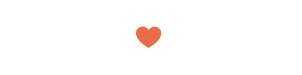

x# Guia de bolso de SVG
## [*Por Joni Trythall*](httpw://jonibologna.com/)
### Tradução por [*Willian Justen*](http://github.com/willianjusten) e [*Lucas Maia*](http://github.com/lucasmaiaesilva)
#### [Compre a versão PDF aqui](http://svgpocketguide.com/) (Versão em inglês)

## Muito Obrigado!

Eu gostaria de dedicar essa sessão inteira para deixar um especial "Muito obrigado!" para:

* [CSS-Tricks](http://css-tricks.com/)
* [Lincoln Loop](http://lincolnloop.com/)
* [Designmodo](http://designmodo.com/)
* [Tahoe Partners](http://tahoepartners.com/Pages/Tahoe%20Partners.aspx)

Fico bastante agradecida pelo suporte a este livro e espero realmente não ter ofendido nenhum de vocês por não utilizar sua fruta favorita.

## Table of Contents
* Introduction
	* Before You Begin
		* Using SVG
		* Vector Graphic Software
		* Inline SVG
		* SVG User Accessibility
		* General Notes
* Section 1: Document Organization
	* Organization & Semantics
		* svg Element
		* g Element
		* use Element
		* defs Element
		* symbol Element
	* Stacking Order
* Section 2: Basic Shapes & Paths
	* Basic Shapes
		* Rectangle
		* Circle
		* Ellipse
		* Line
		* Polyline
		* Polygon
	* The path Element
		* path data
			* moveto
			* closepath
			* lineto
				* L, l
				* H, h
				* V, v
			* Curve Commands
				* Cubic Bézier
				* Quadratic Bézier
				* Elliptical Arc
	* Embeds From Vector Software
* Section 3: Workspace
	* viewport
	* viewBox
		* preserveAspectRatio
	* Coordinate System Transforms
		* translate
		* rotate
		* scale
		* skew
* Section 4: Fills & Strokes
	 * fill Properties
	 	* fill
	 	* fill-rule
	 	* fill-opacity
	 * stroke Attributes
	 	* stroke
	 	* stroke-width
	 	* stroke-linecap
	 	* stroke-linejoin
	 		* stroke-miterlimit
	 	* stroke-dasharray
	 	* stroke-dashoffset
	 	* stroke-opacity
* Section 5: The text Element
	* Basic Attributes
		* x, y, dx, dy
		* rotate
		* textLength & lengthAdjust
	* The tspan Element
	* Spacing Properties
		* kerning & letter-spacing
		* word-spacing
	* text-decoration
	* text Along a Path
		* textPath Element
		* xlink:href
		* startOffset
* Section 6: Advanced Features
	* Gradients
		* Linear Gradients
			* stop Nodes
			* x1, y1, x2, y2
			* gradientUnits
			* spreadMethod
			* gradientTransform
			* xlink:href
		* Radial Gradients
		* cx, cy, r
		* fx, fy
	* Patterns
		* Basic Attributes
			* x, y, width, height
			* patternUnits
			* patternContentUnits
		* Nested Patterns
	* Clipping Path
* Conclusion

## Introdução

Scalable Vector Graphics (SVG) é uma linguagem para descrever gráficos bidimensionais baseada no padrão XML. Esses gráficos consistem em caminhos, imagens e/ou textos capazes de serem escalados e redimensionados sem perder a qualidade de imagem.

Em resumo SVG refere-se a códigos escritos e incorporados juntamente com o HTML para gerar esses gráficos no browser, o qual será o foco deste livro.

Existem muitas vantagens em usar o SVG dessa maneira, incluindo ter acesso a partes individuais do gráfico para propósitos de interatividade, gerando textos pesquisáveis, acesso ao DOM para edições diretas, e promovendo a acessibilidade ao usuário.

Começando com a organização básica e formas simples, nós vamos então continuar a descrever o sistema de coordenadas do SVG ou "canvas", pintando o interior do gráfico e/ou sua borda, transformando-o, e usando a "manipulação gráfica" do texto. Só então vamos acrescentá-lo com toques e técnicas mais avançadas como gradientes e padrões.

Esse guia tem o propósito de fornecer uma rápida porém consistente introdução para se construir SVG *inline*, e ao mesmo tempo, de forma alguma, abrange todos os recursos disponíveis, portanto, deve ser útil no processo de inicialização de Designers e Desenvolvedores que desejam adicionar o SVG em seu *workflow* de maneira mais acessível possível.

A partir de pequenos detalhes para começar a escrever seu próprio código, este guia pretende ser uma referência para escrever SVG.

### Antes de você começar

Enquanto esse "Guia de bolso" é destinado para aqueles que já sabem uma coisa ou duas sobre HTML e CSS, existem algumas coisas adicionais que serão úteis em saber antes de aprofundar no código SVG em seu *browser* favorito, tais como: A informação necessária dentro do fragmento SVG para a renderização adequada, como fazer seus gráficos tão acessíveis quanto possível, e também saber como e quando usar software geradores de vetores gráficos.

#### Usando SVG

Existem [algumas maneiras diferenças de incluir o SVG](http://css-tricks.com/using-svg/) em seus projetos: *inline*, com a tag ``, como *background-image*, como `<object>`, ou como *Data URI's*. Estaremos, de maneira específica, abordando o uso do SVG *inline*, que envolve a escrita de código SVG diretamente dentro do corpo de um documento HTML devidamente estruturado.

Por enquanto, só abordaremos SVG inline aqui, mas vale ressaltar que podem haver casos em que um outro método pode ser mais apropriado. Por exemplo, quando você não pretende editar propriedades diretamente no próprio gráfico ou acessar partes individuais do mesmo, usá-lo com um `` talvez seja mais adequado ao seu projeto.

#### Sofwares de Vetor Gráfico

Softwares de vetor gráfico são opções quando você está procurando criar gráficos mais complexos que não fariam sentido escrevê-los a mão. Sotwares como [Adobe Illustrator](http://www.adobe.com/products/illustrator.html), [Inkscape](http://www.inkscape.org/en/), [Sketch](http://bohemiancoding.com/sketch/), [iDraw](http://www.indeeo.com/idraw/), ou [WebCode](http://www.webcodeapp.com/) podem ser ferramentas úteis para o seu SVG.

A vantagem destes tipos de ferramentas é que você pode exportar seu código SVG e incorporá-lo diretamente em seu HTML. Vamos tocar nesse assunto um pouco adiante.

#### *Inline* SVG na Web

Para simplificar, ao longo do livro, o DOCTYPE SVG, número da versão assim como xmlns e xml:space foram excluídos de todas os exemplos de código.

Esses atributos especificam ao *browser* a [versão do SVG](http://www.w3.org/TR/xml11/) sendo usado no momento assim como o [*namespace*](http://www.w3.org/TR/REC-xml-names/) do documento. A principal coisa a lembrar neste momento é que você geralmente não precisa incluir esses atrtibutos para renderizar com sucesso o seu gráfico no navegador.

Vamos dar uma olhada nestes atributos agora, em um exemplo de código SVG gerado pelo Illustrator, para garantir que isso não irá deixá-lo surpreso quando começar:

	<!DOCTYPE svg PUBLIC "-//W3C//DTD SVG 1.1//EN" "http://www.w3.org/Graphics/SVG/1.1/DTD/svg11.dtd">
	<svg version="1.1" xmlns="http://www.w3.org/2000/svg" xmlns:xlink="http://www.w3.org/1999/xlink" xml:space="preserve">
	</svg>

Na maioria dos casos o DOCTYPE e seus atributos dentro do elemento `<svg>` não são essenciais para que seu gráfico seja renderizados e podem ser descartados, com o objetivo de "limpar" seu código.

#### SVG - Acessibilidade do Usuário

Utilizar recursos de [Acessibilidade SVG](http://www.sitepoint.com/tips-accessible-svg/) é um ótimo hábito a se formar, mas novamente por questão de simplicidade, descrições e títulos não serão incluídos no código no decorrer deste livro.

Uma vez que você se torne mais experiente ao escrever o SVG, a inclusão desses elementos irá tornar seus gráficos mais acessíveis aos usuários. Por exemplo, o conteúdo dentro do elemento `<desc>` permite o fornecimento de uma descrição detalhada de gráficos para usuários com *screen readers*.

O texto em SVG também possui uma enorme vantagem sobre imagens baseadas em *raster* tradicionais em termos de acessibilidade. Isto porque o texto em SVG pode ser detectado e lido pelo *browser*, e pode facilmente ser redimensionado para acomodar as preferências específicas de leitura.

#### Notas Gerais

Um pouco mais de notas gerais antes de você mergulhar no livro: As fontes usadas ao longo deste livro estão disponíveis em [Google Fonts](https://www.google.com/fonts). Enquanto isso você terá acesso explicitado através do `font-family` aqui, o que você não verá e terá que incluir em seu documento, é o `link` ou o `@import` obtido através do Google Fonts.

Os exemplos, utilizam-se de *pixels* e porcentagem, como unidades de medida. Os tamanhos que suportam o SVG como unidades de medida são: em, ex, px, pt, pc, cm, mm, in, e porcentagens.

Os códigos SVG neste livro podem ser adicionados em qualquer editor de texto e então visualizados em [qualquer *browser* que suporte *inline* SVG](http://caniuse.com/svg-html5). Enquanto o suporte dos *browsers* é muito presente para o SVG no geral, este suporte pode se tornar muito menos consistente com técnicas mais avançadas como gradientes, por exemplo. [*Can I Use*](http://caniuse.com/) é um ótimo lugar para checar o suporte do seu *browser* para esses tipos de recursos, mas em última, nada que você vai aprender encontra-se em versão de teste.

Além disso tudo, você pode também copiar o código como está, colar dentro da sessão do HTML dentro do [CodePen](http://codepen.io/), e pode ver instantâneamente o seu gráfico na tela. Não posso dizer tudo que essa ferramenta pode fornecer, já que estava interessada no SVG em primeiro lugar. É o meu jeito favorito de aprender: brincando, raciocinando e algumas vezes falhando miseravelmente.

Finalmente, alguns exemplos irão conter porções de gráficos com códigos comentados a fim de minimizar o tamanho do bloco de código quando aquela porção particular não é essencial para a explicação do tópico em si.

	<svg>
		<!--<path d=<this path is commented out> />-->
	</svg>

## Seção 1. Organização do documento

Os detalhes do SVG residem dentro do elemento `<svg>`. Este elemento contém alguns atributos que permitem a custumização do seu gráfico no *"canvas"*. Enquanto esses atributos não são completamente necessários para renderizar uma imagem, não utilizá-los também pode deixar gráficos mais complexos vulneráveis a não renderizar corretamente em todos os browsers.

Como mencionado, gráficos *inline* podem ser escritos "na mão", ou incorporados acessando o código XML gerado pelos softwares gráficos. De qualquer forma, uma organização e estrutura adequedas são cruciais para uma escrita eficiente do SVG, principalmente porque a ordem dos elementos gráficos determinam sua ordem no empilhamento.

### Organização e Semântica

Um fragmento de documento de SVG é feito de vários elementos contidos dentro do elemento `<svg>`. A organização desse documento é crucial. O conteúdo deste documento pode aumentar rapidamente, e uma organização adequada promove acessibilidade e eficiência, beneficiando ambos, o autor e seus usuários.

Esta seção irá introduzir a chave para escrever SVG - o elemento `<svg>`- e revisar alguns atributos comuns que irão auxiliar num documento inicial.

#### O elemento svg

O elemento `<svg>`é classificado tanto como um *container* quanto como um elemento estrutural, e pode ser usado para criar um fragmento SVG independente dentro do documento. Este fragmento tendo seu próprio sistema de coordenadas.

Os atributos usados neste elemento, como `width`, `height`, `preserveAspectRatio`e `viewBox` definem o espaço onde o gráfico será escrito.

Ao obter o código SVG de algum software de vetor ele terá [várias informações](http://www.w3.org/TR/SVG/struct.html#SVGElement) dentro do elemento `<svg>`, como a versão do SVG (indica a versão da linguagem SVG que está sendo utilizada) e o DOCTYPE. Como mencionado anteriormente, essa informação não será incluída no decorrer deste guia, e sua exclusão não irá prejudicar a renderização do gráfico em sua tela.

#### O elemento g

O `g` é um elemento de *container* que serve para agrupar elementos gráficos relacionados. Utilizando este elemento junto com os elementos de descrição e título podemos fornecer informações sobre o gráfico, ajudando assim, a organização e acessibilidade através do agrupamento desses componentes.

Além disso, ao agrupar elementos relacionados, você pode manipular o grupo como um todo contra as partes individuais. Isto é especialmente útil quando se quer animar estes elementos, por exemplo, a animação pode ser aplicada ao grupo.

Qualquer elemento que não está contido em um `g` é considerado como seu próprio grupo.

#### O elemento use

O elemento `<use>` permite reutilizar elementos ao decorrer do documento. Esses atributos adicionais podem ser incluídos com o elemento, como `x`, `y`, `width`, e `height`, que definem os detalhes de localização do gráfico dentro do sistema de coordenadas.

Usar o atributo `xlink:href`, permite que você chame o elemento para ser reutilizado. Por exemplo, se existe um `<g>` com um `id` "apple" contendo uma imagem de uma maçã que precisa ser reutilizada, essa imagem pode ser referenciada pelo `<use>`: `<use x="50" y="50" xlink:href="#apple" />`
g
Este elemento pode poupar um tempo significante e minimizar a quantidade de código requerido.

#### O elemento defs

Enquanto o `<use>` permite reutilizar um gráfico já renderizado, gráficos com o elemento `<defs>` não são renderizados no canvas, mas estão hábeis a serem referenciados e renderizados utilizando o `xlink:href`.

Gráficos são definidos com o `<defs>` e podem ser utilizados no decorrer do documento referenciados a `id` desse gráfico.

Por exemplo, o seguinte código desenha um gradiente muito simples em um retângulo:

		<svg>
    		<defs>
      			<linearGradient id="Gradient-1">
        			<stop offset="0%" stop-color="#bbc42a" />
        			<stop offset="100%" stop-color="#765373" />
      			</linearGradient>
    		</defs>
    		<rect x="10" y="10" width="200" height="100" fill= "url(#Gradient-1)" stroke="#333333" stroke-width="3px" />
  		</svg>

O conteúdo de `<defs>` não tem saída visual até que seja chamado pela sua referência única, o `id`, que neste caso está sendo feito através do atributo `fill` do retângulo.

#### O elemento symbol

O elemento `<symbol>` é similar ao `<g>`, já que permite uma forma de agrupar elementos, entretanto, elementos com o `<symbol>` não tem saída visual (assim como `<defs>`), até que seja chamado pelo elemento `<use>`.

Também diferente do elemento `<g>`, o `<symbol>` estabelece seu próprio sistema de coordenadas separado da *viewport* em que está renderizado.

*SVG viewport* e `viewBox`, que estabelecem o sistema de coordenadas para os gráficos, serão falados mais tarde, numa seção diferente.

### Ordem de empilhamento (*Stackering Order*)

A ordem de empilhamento do SVG não pode ser manipulada pelo `z-indez` no CSS como os outros elementos do HTML podem. A ordem que estes elementos são empilhados no SVG dependem inteiramente de sua posição dentro do documento.

As uvas e a melância estão no mesmo elemento `<svg>` abaixo. A melância aparece a frente das uvas porque o grupo que contém o caminho que faz seu desenho está listado antes das uvas no documento.

	<svg>
		<g class="grapes">
			<!--<path <stem path> />-->
			<!--<path <grapes path> />-->
			<!--<path <leaf path> />-->
		</g>
		<g class="watermelon">
			<!--<path <outside path> />-->
			<!--<path <inside path> />-->
			<!--<path <seeds path> />-->
		</g>
	</svg>

Se o grupo que contém as uvas for movido para o fim do documento, ele irá aparecer então na frente da melância.

	<svg>
		<g class="watermelon">
			<!--<path <outside path> />-->
			<!--<path <inside path> />-->
			<!--<path <seeds path> />-->
		</g>
		<g class="grapes">
			<!--<path <stem path> />-->
			<!--<path <grapes path> />-->
			<!--<path <leaf path> />-->
		</g>
	</svg>

Este método também determina a ordem que os elementos individuais irão empilhar. Por exemplo, movendo o caminho que desenha a haste das uvas para o fim do grupo, irá resultar numa imagem com a haste na frente.

## Seção 2. Formas Básicas e *Paths*

As formas básicas em SVG podem ser escritas "na mão" em HTML, mas você pode eventualmente passar pela experiência de precisar usar gráficos inline muito mais complexos. Estes gráficos mais complexos podem ser gerados por softwares de vetores, mas por enquanto vamos nos atentar ao básico, que pode facilmente ser escrito "na mão".

### Formas básicas

O SVG possui os seguintes elementos que compõe as formas básicas: retângulos, circulos, elipses, linhas simples, polyline e polígonos. Cada elemento requer uma lista de atributos antes de serem renderizados, tais como coordenadas e detalhes de tamanho.

#### O elemento rect

O elemento `<rect>` é usado para definir o retângulo.

		<svg>
  			<rect width="200" height="100" fill="#BBC42A" />
		</svg>

Os atributos `width` e `height` estabelecem o tamanho do retângulo, enquanto `fill` define o preenchimento interior para a forma. Os valores numéricos padrão são em *pixels* e o `fill` deverá permanecer na cor preta quando deixado sem especificação.

Outros atributos que podem ser incluídos são as coordenadas `x` e `y`. Esses valores irão mover a forma apropriadamente de acordo com as dimensões setadas ao longo do documento `<svg>`.

Também é possível criar cantos arredondados espeificando valores com os atributos `rx` e `ry`. Por exemplo, `rx="5" ry="10"` vão renderizar uma forma com os cantos horizontais com 5px de *radius*, e verticais com 10px de *radius*.

#### O elemento circle

O elemento `<circle>` é usado para definir um círculo mapeado com base em um ponto central e pelo tamanho de seu raio.

		<svg>
  			<circle cx="75" cy="75" r="75" fill="#ED6E46" />
		</svg>

As coordenadas `cx` e `cy`estabelecem a localização do centro do circulo em relação as dimensões configuradas no seu *workplace* pelo elemento `<svg>`.

O atributo `r` define o tamanho do raio do circulo.

#### O elemento ellipse

O elemento `<ellipse>` define uma elipse na qual seu mapeamento basea-se em um ponto central e  dois raios.

		<svg>
  			<ellipse cx="100" cy="100" rx="100" ry="50" fill="#7AA20D" />
		</svg>

Enquanto os valores `cx` e `cy` estabelecem um ponto central baseado na distância das coordenadas de espaço dentro do `<svg>`, os valores de `rx` e `ry` definem os raios horizontais e verticais da forma.

#### O elemento line

O elemento `<line>` define uma linha simples com um ponto inicial e um ponto final.

		<svg>
  			<line x1="5" y1="5" x2="100" y2="100" stroke="#765373" stroke-width="8"/>
		</svg>

Juntos, os valores `x1` e `y1` estabelecem as coordenadas para o ponto de inicio da linha, enquanto os valores de `x2` e `y2` estabelecem o ponto final da linha.

#### O elemento polyline

O elemento `<polyline>` é usado para definir um conjunto de linhas simples interligadas que, geralmente, resultam em um formato aberto (os pontos de início e fim não são conectados).

		<svg>
  			<polyline points="0,40 40,40 40,80 80,80 80,120 120,120 120,160" fill="white" 			stroke="#BBC42A" stroke-width="6" />
		</svg>

Os valores dentro do atributo `points` estabelecem ao formato a localização de `x` e `y` distribuídos através do elemento `<polyline>` e são agrupados como `x,y` distribuido por uma lista de valores.

Qualquer número diferente de entradas aqui, retornará erro.

#### O elemento polygon

O elemento `<polygon>` é usado para definir uma forma fechada, que consistem em linhas conectadas.

		<svg>
  			<polygon points="50,5 100,5 125,30 125,80 100,105 50,105 25,80 25,30" 					fill="#ED6E46" />
		</svg>

Os pontos do polígono são definidos através de uma série de oito grupos de valores `x,y`.

Este elemento pode também, produzir outros tipos de formatos fechados dependendo do número de pontos definidos.

### O Elemento *path*

Os *paths* em SVG representam as linhas externas de uma forma. Essa forma pode ser preenchida, contornada, usado para navegação com texto, e/ou usada como *clipping path*.

Dependendo da forma  este *path* pode se tornar muito complexo, especialmente quando existem muitas [curvas](http://www.w3.org/TR/SVG/paths.html#PathDataCurveCommands) envolvidas. Com um conhecimento básico de como funciona, a sintaxe envolvida, enfim, esses processos vão tornar esses *paths* muito mais gerenciáveis.

#### dados do *path*

Os dados do *path* possuem o atributo `d` dentro do elemento `<path>`, definindo a borda externa do formato: `<path d="<dados específicos do path>" />`.

Estes dados são incluídos no atributo `d` acompanhado de instruções sobre o *path* tais como *moveto*, *line*, *curve*, *arc* e *closepath*.

O elemento `<path>` abaixo contém as coordenadas específicas para renderização de um limão:

	<svg width="258px" height="184px">
  		<path fill="#7AA20D" stroke="#7AA20D" stroke-width="9" stroke-linejoin="round" d="M248.761,92c0,9.801-7.93,17.731-17.71,17.731c-0.319,0-0.617,0-0.935-0.021c-10.035,37.291-51.174,65.206-100.414,65.206 c-49.261,0-90.443-27.979-100.435-65.334c-0.765,0.106-1.531,0.149-2.317,0.149c-9.78,0-17.71-7.93-17.71-17.731 c0-9.78,7.93-17.71,17.71-17.71c0.787,0,1.552,0.042,2.317,0.149C39.238,37.084,80.419,9.083,129.702,9.083	c49.24,0,90.379,27.937,100.414,65.228h0.021c0.298-0.021,0.617-0.021,0.914-0.021C240.831,74.29,248.761,82.22,248.761,92z" />
	</svg>

##### O comando moveto

O comando *moveto* (M ou m) estabelece um novo ponto, como se fosse uma linha sendo movida por um traço de caneta. A linha de código que compreende os dados do *path* precisa começar com o comando *moveto*, como mostrado no exemplo do limão, visto acima.

Comandos moveto que começam com sua inicial representam um novo *subpath*, criando assim um novo *path* composto. A inicial maiúscula *M* indica que irá seguir coordenadas absolutas, enquanto a inicial minúscula *m* indica coordenadas relativas.

##### O comando closepath

O *closepath* (Z ou z) finaliza o *path* atual e resulta em uma linha reta sendo desenhada a partir do ponto inicial desse *path*.

Se o *closepath* é seguido imediatamente por um *moveto*, as coordenadas desse *moveto* representam o início de um novo *path*. Se este mesmo *closepath* é seguido de qualquer outro elemento que não seja o moveto, o próximo caminho irá iniciar no mesmo ponto do caminho anterior.

Ambos maiúsculo e mínusculo z, tem o mesmo resultado.

##### O comando lineto

O comando lineto desenha uma linha reta do ponto atual até o novo ponto.

###### L, l

Os comandos *L* e *l* desenham uma linha do ponto atual até o próximo ponto dado nas coordenadas. Este novo ponto se torna o ponto atual e por aí vai.

Um *L* maiúsculo determina que o *path* irá seguir posicionamento absoluto, enquanto um *l* minúsculo usa posição relativa.

###### H, h

Os comandos H e h desenham uma linha horizontal do ponto atual.

Um *H* maiúsculo determina que irá seguir posicionamento absoluto, enquanto um *h* minúsculo usa posição relativa.

###### V, v

os comandos V e v desenham uma linha vertical do ponto atual.

Um *V* maiúsculo determina que irá seguir posicionamento absoluto, enquanto um *v* minúsculo usa posição relativa.

##### Os comandos de curva

Existem 3 grupos de comandos que desenham caminhos curvos: *Curvas Cúbicas de Bézier* (C, c, S, s), *Curvas quadráticas de Bézier* (Q, q, T, t), e *Curva Elíptica* (A, a).

A seguinte seção sobre curvas irá introduzir o conceito básico por trás de cada comando de curva, revisar os detalhes de posicionamento e em seguida, fornecer um diagrama para melhor compreensão.

###### Curvas Cúbicas de Bézier

Os comandos C e c das curvas cúbicas de Bézier desenham uma curva utilizando os parâmetros (x1,y1) como ponto de controle do início da curva e (x2,y2) como ponto de controle do final da curva, definindo assim a forma que esta irá possuir.

Os comandos S e s também irão desenhar uma curva cúbica de Bézier, mas neste caso iremos assumir que o primeiro ponto de controle é a *reflexão* do segundo ponto de controle.

O seguinte código desenha uma curva cúbica de Bézier básica:

	<svg>
  		<path fill="none" stroke="#333333" stroke-width="3" d="M10,55 C15,5 100,5 100,55" />
	</svg>

Manipulando o primeiro e o último conjunto de pontos para essa curva, irá impactar na localização do seu início e fim, enquanto manipular os dois pontos centrais, irá impactar na forma e posicionamento da curva em si.

Os comandos S e s também irão desenhar uma curva cúbica de Bézier, mas neste caso iremos assumir que o primeiro ponto de controle é a *reflexão* do último ponto de controle do comando *C* anterior. Esta reflexão é relativa ao ponto inicial do comando *S*.

Um *C* maiúsculo determina que irá seguir posicionamento absoluto, enquanto um *c* minúsculo usa posição relativa. A mesma lógica é aplicada a *S* e *s*.

###### Curvas Quadráticas de Bézier

As Curvas Quadráticas de Bézier (Q, q, T, t) são similares as Curvas Cúbicas de Bézier, exceto que elas possuem somente um ponto de controle.

O seguinte código desenha uma curva quadrática de Bézier básica:

	<svg>
  		<path fill="none" stroke="#333333" stroke-width="3" d="M20,50 Q40,5 100,50" />
	</svg>

Manipulando o primeiro e último conjunto de valores, `M20,50` e `100,50`, irá impactar no posicionamento dos pontos de início e fim da curva. O conjunto central dos valores, `Q40,5`, define o ponto de controle da curva, estabelecendo sua forma.

Q e q desenham a curva do ponto inicial até o ponto final usando (x1,y1) como o ponto de controle. T e t desenham a curva do ponto inicial até o ponto final assumindo que o ponto de controle é a reflexão do ponto de controle listado anteriormente, relativo ao ponto de partida do novo comando T or t.

Um *Q* maiúsculo determina que irá seguir posicionamento absoluto, enquanto um *q* minúsculo usa posição relativa. A mesma lógica é aplicada a *T* e *t*.

###### Curva Elíptica

Uma curva elíptica (A, a) define um segmento de uma elipse. Esses segmentos são criados através dos comando *A* ou *a* que criam um arco especificando um ponto inicial, ponto final, raios x e y, rotação e direção.

Aqui está um código de um curva elptica básica:

	<svg>
  		<path fill="none" stroke="#333333" stroke-width="3" d="M65,10 a50,25 0 1,0 50,25" />
	</svg>

O primeiro e último conjunto de valores dentro do *path*, `M65,10` and `50,25`, representam as coordenadas inicial e final, enquanto o segundo conjunto de valores definem os dois raios. O valor de `1.0` (*large-arc-flag* and *sweep-flag*) determina como o arqco será desenhado, a partir das quatro diferentes opções.

O seguinte diagrama mostra as quatro opções e o impacto que esses valores tem na renderização final do segmento de arco.

### Incorporando de um Programa de vetor gráfico

Programas de vetor gráfico permitem a geração de formas e caminhos mais complexos, enquanto produzem código SVG que pode ser capturado, utilizado e manipulado em qualquer lugar.

Uma vez que o desenho estiver completo, o código XML gerado, que pode ser um pouco grande dependendo de sua complexidade, pode ser copiado e incorporado no HTML. Quebrar cada seção do SVG e manter uma organização correta dos elementos, pode ser de grande ajuda na navegação e entendimento de documentos aparentemente complexos.

Aqui está o código SVG de algumas cerejas com classes adicionadas para melhor navegação:

		<svg width="215px" height="274px" viewBox="0 0 215 274">
			<g>
				<path class="stems" fill="none" stroke="#7AA20D" stroke-width="8" stroke-linecap="round" stroke-linejoin="round" d="M54.817,169.848c0,0,77.943-73.477,82.528-104.043c4.585-30.566,46.364,91.186,27.512,121.498" />
				<path class="leaf" fill="#7AA20D" stroke="#7AA20D" stroke-width="4" stroke-linecap="round" stroke-linejoin="round" d="M134.747,62.926c-1.342-6.078,0.404-12.924,5.762-19.681c11.179-14.098,23.582-17.539,40.795-17.846 c0.007,0,22.115-0.396,26.714-20.031c-2.859,12.205-5.58,24.168-9.774,36.045c-6.817,19.301-22.399,48.527-47.631,38.028 C141.823,75.784,136.277,69.855,134.747,62.926z" />
			</g>
			<g>
				<path class="r-cherry" fill="#ED6E46" stroke="#ED6E46" stroke-width="12" d="M164.836,193.136 c1.754-0.12,3.609-0.485,5.649-1.148c8.512-2.768,21.185-6.985,28.181,3.152c15.076,21.845,5.764,55.876-18.387,66.523 c-27.61,12.172-58.962-16.947-56.383-45.005c1.266-13.779,8.163-35.95,26.136-27.478	C155.46,191.738,159.715,193.485,164.836,193.136z" />
				<path class="l-cherry" fill="#ED6E46" stroke="#ED6E46" stroke-width="12" d="M55.99,176.859 c1.736,0.273,3.626,0.328,5.763,0.135c8.914-0.809,22.207-2.108,26.778,9.329c9.851,24.647-6.784,55.761-32.696,60.78 c-29.623,5.739-53.728-29.614-44.985-56.399c4.294-13.154,15.94-33.241,31.584-20.99C47.158,173.415,50.919,176.062,55.99,176.859z" />
			</g>
		</svg>

Os atributos dentro do elemento `svg` definem o workspace, ou *"canvas"* para o desenho. A folhas e as hastes estão dentro de um grupo, enquanto as cerejas estão em outro. Os valores em números definem o caminho que o desenho irá tomar e o `fill` e `stroke`, os atributos que irão definir a cor do preenchimento e bordas.

Uma vez que o código é copiado, ele pode passar por um otimizador de SVG antes de ser colocado no HTML, que irá ajudar a eliminar código desnecessário e espaçamentos, reduzindo bastante o tamanho do arquivo. [Peter Collingridge's SVG Optimiser](http://petercollingridge.appspot.com/svg_optimiser) ou [SVGO](https://github.com/svg/svgo) são ferramentas muito úteis nessa tarefa.

## Seção 3. Workspace

Talvez o aspecto mais importante do SVG, depois de entender sua estrutura geral e como criar formas básicas é aprender sobre o *workspace* em uso, em outras palavras, entender o sistema de coordenadas no qual os gráficos vão ser mapeados.

Entender o *workspace* do SVG é útil para saber como renderizar propriamente seu gráfico, porém se torna crucial entender técnicas mais avançadas em SVG. Por exemplo, o mapeamento de gradientes são fortemente estabelecidos pelo sistema de coordenadas do SVG. Este *workspce* é definido por dimensões da *viewport* e atributos da `viewbox`.

Esta pêra, felizmente possui a *viewport* e `viewBox` que correspondem um com o outro:

		<svg width="115" height="190" viewBox="0 0 115 190">
    		<!--<path <path que desenha a pêra> />-->
  		</svg>

A pêra é inteiramente visível no *browser* e vai possuir escala adaptável quando as dimensões da *viewport* forem alteradas.

### viewport

A *viewport* é a parte visível do seu SVG. Enquanto SVG pode ter a largura ou a altura que você definir, limitar a *viewport* pode significar que somente uma certa parte da imagem será vista de cada vez.

A *viewport* é configurada através dos atributos `width` e `height` dentro de `<svg>`.

Se estes valores não forem definidos, as dimensões da *viewport* irão geralmente ser determinados por outros indicadores dentro do SVG, como o `width` do elemento mais externo. Entretando, a não configuração desse elemento deixa o seu gráfico suscetível a ser cortado.

### viewBox

A `viewBox` permite a visualização de uma parte específica de uma parte de um elemento. Esses valores incluem quatro números separados por "commas" ou espaços: `min-x`, `min-y`, `width` e `height` esses parâmetros geralmente, são os limites da *viewport*.

Os valores `min` representam em qual ponto dentro da imagem a `viewBox` deve iniciar, enquanto o `width` e `height` estabelecem o tamanho do box.

Se nós optarmos por não definir a `viewBox` a imagem não será escalada e irá corresponder a configuração feita na *viewport*.

Se 50px forem tirados de `width` e `height` da `viewBox`, a porção da imagem da pêra que está visível é reduzida, porém a parte que ainda pode ser visualizada se encaixa nas definições da *viewport*.

		<svg width="115px" height="190px" viewBox="0 0 65 140">
			<!--<path <path que desenha a pêra> />-->
		</svg>

Os valores de `min` dentro da `viewBox` definem o início da `viewBox` dentro de seu elemento pai. Em outras palavras, os pontos dentro da `viewBox` são as coordenadas no qual iremos criar o campo de visualização. No desenho da pêra acima os valores de `min` eram 0,0 (topo, esquerda). Vamos mudar esses valores para 50, 30: `viewBox="50 30 115 190"`.

		<svg width="115" height="190" viewBox="50 30 115 190">
			<!--<path <path que desenha a pêra> />-->
		</svg>

A `viewBox` agora começa com 50px ao longo do eixo `x` e 30px ao longo do eixo `y`. Alterando esses parâmtros a parte da pêra que está em foco é modificada.

#### preserveAspectRatio

Se a *viewport* e `viewBox` não possuirem as mesmas dimensões de `width` e `height`, o atributo `preserveAspectRatio` direciona o browser em como efetuar o display da imagem.

O atributo `preserveAspectRatio` requer dois parâmetros, `<align>` e `<meetOrSlice>`. O primeiro parâmetro possui duas partes que direciona o alinhamento da `viewBox` dentro da *viewport*. O segundo é opcional e indica como o aspecto da dimensão será preservado.

`preserveAspectRatio="xMaxYMax meet"`

Estes valores vão alinhar o canto direito inferior da `viewBox` ao canto direito inferior da *viewport*. O `meet` preserva o aspecto da dimensão da escala da `viewBox` para se encaixar como a *viewport* o máximo possível.

Existem três opções de `<meetOrSlice>`: `meet` (padrão), `slice`, e `none`. Enquanto o `meet` se encarrega de produzir uma visibilidade completa do gráfico (o máximo possível), a função do `slice` é preencher a *viewport* com a `viewBox` e então cortar qualquer outra parte da imagem que não estiver dentro da *viewport* despois desta escala. `none` resulta na não preservação da dimensão e uma provável distorção da imagem.

Talvez o valor mais inapropriado aqui é o *none*, no qual estabelece uma escala uniforme que talvez não deveria ser aplicada. Se aumentarmos os valores em pixels da *viewport*, a imagem abaixo das cerejas vai se tornar não uniforme e ficará distorcida.

		<svg width="500" height="400" viewBox="0 0 250 600" preserveAspectRatio="none">
			<!--<path <path que desenha a cereja> />-->
		</svg>

Já o `preserveAspectRatio` da imagem abaixo está configurado para `xMinYMax meet` no qual está alinhado ao canto inferior esquerdo da *viewport*. O `meet` se certifica que a imagem está escalada para se encaixar dentro da *viewport* da melhor maneira possível.

		<svg width="350" height="150" viewBox="0 0 300 300" preserveAspectRatio="xMinYMax meet" style="border: 1px solid #333333;">
			<!--<path <path que desenha a cereja> />-->
		</svg>

Aqui nós temos as mesmas cerejas quando `meet` é mudado para `slice`:

		<svg width="350" height="150" viewBox="0 0 300 300" preserveAspectRatio="xMinYMax slice" style="border: 1px solid #333333;">
			<!--<path <path que desenha a cereja> />-->
		</svg>

Perceba que os valores de alinhamento não precisam ser corrigidos.

		<svg width="350" height="150" viewBox="0 0 300 300" preserveAspectRatio="xMinYMid slice" style="border: 1px solid #333333;">
			<!--<path <path que desenha a cereja> />-->
		</svg>

O exemplo mostrado acima tem o `preserveAspectRatio` de `xMinYMid slice`; as cerejas agora estão alinhadas pelo meio do eixo `y` da *viewport*.

### Sistema de transformação de coordenadas

O SVG dispõe de alterações adicionais no gráfico como rotação, dimensionamento, movimento e torção através do uso de *transforms*. As transformações do SVG podem se aplicar desde elementos individuais até um grupo inteiro de elementos.

Essas funções são incluídas dentro do elemento a ser manipulado e residem dentro do atributo `<transform>`. Múltiplos *transforms* podem ser incluídos em diversas funções dentro deste atributo, por exemplo: `transform="translate(<tx>,<ty>) rotate(<rotation angle>)" />`.

Uma coisa importante para ficar na cabeça quando transformar SVG é que isto irá impactar no seu sistema de coordenadas ou *workspace*. Isto acontece porque [transforms criam um novo espaço](http://www.w3.org/TR/SVG/coords.html#EstablishingANewUserSpace) ou seja, você está essencialmente copiando o gráfico original e colocando a transformação em um novo sistema de coordenadas.

A seguinte imagem demonstra a transformação que o sistema de coordenadas sofre quando se faz uma translação de (100,100) em um grupo contendo o gráfico:

O sistema de coordenadas como um todo é transladado e a imagem da lima e do limão é mantida no posicionamento original com o sistema. O novo sistema de coordenadas tem a origem localizada em (100,100) do sistema de coordenadas original. 

Devido a este relacionamento com o sistema de coordenadas, várias das funções irão mover o desenho mesmo que você não defina diretamente a translação no elemento. Por exemplo, a tentativa de triplicar o tamanho de uma imagem com um `scale` no valor de "3", está multiplicando as coordenadas `x` e `y` por "3" e a imagem está sendo escalada em torno disso, movendo toda a tela no processo. 

No caso de transformações em cadeia, os efeitos são acumulativos, então a transformação no elemento filho será baseada na acumulação de transformações antes do mesmo.

#### translate

A função `translate` especifica os detalhes para mover uma forma, e os dois valores numéricos incluem os movimentos ao longo dos eixos `x` e `y`: `transform="translate(<tx>,<ty>)"`
Esse valores podem ser separados por espaços ou vírgulas.

O valor `y` é opcional e se omitido é assumido o valor de "0".

#### rotate

O valor com `rotate` irá especificar a rotação da forma a partir de seu ponto de origem (em graus), que para o SVG é 0,0 (superior esquerda): `transform="rotate(<ângulo de rotação>)"`

Existe também a opção de incluir os valores de `x` e `y`: `transform=rotate(<ângulo de rotação> [<cx>,<cy>])`. Se adicionado, esses valores estabelecem um novo centro de rotação diferente do que é definido no padrão (que é 0,0).

Aqui está uma maçã antes e depois de ter uma rotação de 20 graus aplicada:
`transform="rotate(20)"`.
*Perceba que a imagem não reflete a mudança nas coordenadas que esta transformação faz.*

g

#### scale

Permite redimensionar os elementos do svg através da função `scale`. Esta função aceita um ou dois valores que especificam valores de escala horizontal e vertical ao longo do eixo apropriado: `transform="scale(<sx> [<sy>])"`.

O valor `sy` é opcional e se omitido é assumido como igual ao `sx` que garante consistência no redimensionamento.

Um `scale`no valor de ".5" irá renderizar um gráfico com metade do seu tamanho original, enquanto um valor de "3" irá triplicar seu tamanho inicial. Um valor de "4,2" irá dimensionar o gráfico quatro vezes da sua largura original e duas vezes de sua altura original.

#### skew

Elementos SVG podem ser torcidos, or entortados, através do uso das funções `skewX` e `skewY`. Os valores que que essas funções aceitam representam a transformação em graus ao longo dos eixos apropriados.

Aqui está uma maçã antes e depois de adicionar um `skewX` no valor de "20": `transform="skewX(20)"`. *Perceba que a imagem não reflete a mudança nas coordenadas que esta transformação faz.*

## Seção 4. Preenchimentos e Contornos

`fill` e `stroke` nos permitem pintar o interior e borda de um SVG.

"[Pintar](http://www.w3.org/TR/SVG/painting.html#Introduction)" referencia a ação de aplicar cor, gradientes, padrões ao gráfico através do `fill` e/ou `stroke`.

### Propriedades de preenchimento

O atributo `fill` pinta o interior de um elemento gráfico específico. Este preenchimento pode consistir de uma cor sólida, gradiente ou padrão.

O interior da forma é determinado examinando todos os caminhos e especificações com o `fill-rule`. 

Quando preenchendo uma forma ou caminho, `fill` irá pintar caminhos abertos como se o último ponto estivesse conectado ao primeiro, apesar de a cor do `stroke` nessa seção não ser renderizada.

#### fill-rule

A propriedade de `fill-rule` indica ao algorimo quais partes do canvas devem ser incluídas dentro da forma. Isso nem é sempre é fácil quando se trabalha com interseções mais complexas ou caminhos fechados.

Os valores aceitos são `nonzero`, `evenodd`, `inherit`.

##### nonzero

O valor de `nonzero` determina o interior de um ponto em todo o *canvas*, desenhando uma linha partindo da área em questão e entre toda a forma em qualquer direção, e então, considerando o local onde um segmento da forma cruza esta linha. Isso se inicia com zero e adiciona um cada vez que um segmento cruza a linha da esquerda para a direita, e substrai um cada vez que o caminho é cruzado da direita para a esquerda.

Se o resultado for zero depois de analisar e contar essas interseções, então o ponto está fora do caminho, caso contrário, ele está dentro.

Essencialmente, se o caminho for desenhado no sentido horário, ele é considerado como interno, mas se ele for desenhado no sentido anti-horário ele é considerado externo e será excluído do processo de `fill`.

##### evenodd

O valor de `evenodd` determina o interior de um ponto em todo o *canvas*, desenhando uma linha partindo da área em questão e entre toda a forma em qualquer direção, e conta quais segmentos do caminho que essa linha cruzou. Se o resultado é um número ímpar, esse ponto é interno, se é par esse ponto é externo.

Dado o algoritmo específico de `evenodd`, a direção do desenho no interior da forma é irrelevante, diferente do `nonzero`, já que estamos simplesmente contando os caminhos que cruzam a linha.

Embora essa propriedade não seja geralmente necessária, ela permite um melhor controle do `fill` em desenhos mais complexos, como mencionado anteriormente.

##### inherit

O valor de `inherit` irá direcionar o elemento a assumir o `fill-rule` especificado em seu elemento pai.

#### fill-opacity

O valor de `fill-opacity` se refere ao nível de opacidade do preenchimento no interior. O valor de "0" resulta numa completa transparência, "1" retira toda a transparência, e valores entre represetam um nível em porcentagem da opacidade.

### Atributos de contorno

Existem algums atributos relacionados ao contorno no SVG, que permitem o controle e manipulação dos detalhes do contorno. As habilidades desses atributem fornecem um grande controle no SVG "feito a mão", mas também prova ser útil quando é necessário se fazer edições em gráficos incoroporados já existentes.

Os exemplos a seguir usam um SVG inline de uvas. Os atributos estão sendo utilizados diretamente na forma do elemento.  

#### stroke

O atributo `stroke` define a cor da borda numa forma ou caminho específico.

A seguinte imagem das uvas tem um contorno roxo: `stroke="#765373"`. 

#### stroke-width

O valor de `stroke-width` estabele a largura do contorno das uvas, o qual está definido para `6px`na imagem.

O valor padrão para este atributo é 1. Se um valor em porcentagem é utilizado, o valor é baseado nas dimensões da *viewport*.

#### stroke-linecap

O `stroke-linecap` define qual forma terá o final de um caminho aberto e ele aceita quatro valores possíveis: `butt`, `round`, `square`, `inherit`.

O valor de `inherit` irá direcionar o elemento para receber o `stroke-linecap` definido pelo seu elemento pai.

A haste na imagem seguinte tem o `stroke-linecap` com o valor `square`:

	<svg>
    	<!--<path <caminho para a uva> />-->
    	<!--<path stroke-linecap="square" <caminho para a haste> />-->
    	<!--<path <caminho para a folha> />-->
  	</svg>

#### stroke-linejoin

O `stroke-linejoin` define qual aparência os cantos dos contornos irão possuir nos caminhos e formas básicas. 

Segue um exemplo das com uvas com um `stroke-linejoin` no valor `"bevel"`:

	<svg>
    	<!--<path stroke-linejoin="bevel" <caminho para as uvas> />-->
    	<!--<path <caminho para a haste> />-->
    	<!--<path <caminho para a folha> />-->
  	</svg>

##### stroke-miterlimit

Quando duas linhas se encontram num ângulo agudo e são definidos para `stroke-linejoin="miter"`, o atributo `stroke-miterlimit` permite especificar o quanto irá se extender essa junção/canto.

O comprimento dessa junção é chamado de comprimento de esquadria, e é medido através do canto interior da linha dessa junção até a ponta exterior dessa junção.

Esse valor será o limite da razão do comprimento da esquadria pelo `stroke-width`.

1.0 é o menor valor possível para este atributo.

A primeira imagem está definida para `stroke-miterlimit="1.0"`, o que irá criar um efeito de chanfro. O `stroke-miterlimit` da segunda imagem está definido para `4.0`.

#### stroke-dasharray

O atributo `stroke-dasharray` transforma os caminhos em traços ao invés de linhas sólidas.

Com o atributo você pode especificar o tamanho do traço, assim como a distância entre eles, separados por vírgulas or espaços.

Se um número ímpar de valores for dado, a lista irá repetir para produzir um número par de valores. Por exemplo, `8,6,4` vira `8,6,4,8,6,4` como mostrado na segunda imagem das uvas abaixo.

Colocar apenas um número dentro deste valor resulta num espaço entre os traços que é igual ao comprimento de um traço.

A primeira imagem mostra o impacto que um número par de valores faz no caminho da uva: `stroke-dasharray="20,15,10,8"`.

#### stroke-dashoffset

O `stroke-dashoffset` especifica a distância para o traço iniciar.

	<svg>
    	<!--<path stroke-dasharray="40,10" stroke-dashoffset="35" <caminho para as uvas> />-->
    	<!--<path <caminho para a haste> />-->
    	<!--<path <caminho para a folha> />-->
  	</svg>

No exemplo acima, temos um traço configurado para ter o tamanho de 40px e um `dashoffset` de 35px. No ponto de partida do caminho do traço, ele não será visível até os 35px dos primeiros 40px do traço, e é por isso que o primeiro traço parece significativamente menor.

#### stroke-opacity

O atributo `stroke-opacity` permite nível de transparência para os contornos.

O valor aqui é decimal entre 0 e 1, com 0 sendo completamente transparente.

## Seção 5: O elemento text

O elemento `<text>` define um gráfico que consiste de texto. Há uma série de opções de atributos para customização deste texto, e gradientes, padrões, recortes, máscaras ou filtros que podem ser aplicados.

Escrever e editar o `<text>` no SVG fornece uma poderosa habilidade de criar textos escaláveis assim como os gráficos que podem ser modificados e editados com o código do SVG. 

Lembre-se de estar consciente das dimensões da *viewport* enquanto trabalhamos nos exemplos desta seção. A *viewport*, como mencionada anteriormente, vai determinar a porção visível do SVG e pode ser necessário modificar a *viewport* dependendo de alguma alteração específica.

### Atributos Básicos

Os atributos de texto do SVG ficam dentro do elemento `<text>`, que está dentro no elemento `<svg>`. Através destes atributos podemos controlar alguns elementos de estilo básicos para o nosso texto, assim como decobrir por completo os detalhes de mapeamento dentro do *canvas*, habilitando total controle de sua localização na tela.

#### x, y, dx, dy

A primeira letra dentro do elemento `<text>` é renderizada de acordo com o estabelecido em `x` e `y`. Enquanto o valor de `x` determinar onde o texto deve iniciar ao longo eixo x, o valor de `y` determinar a localização horizontal do texto da parte inferior do texto.

Enquanto `x` e `y` estabelecem coordenadas em um espaço absoluto, `dx` e `dy` estabelecem em coordenadas relativas. Isto é especialmente útil quando usado em conjunto com o elemento `<tspan>`, que será discutido futuramente na próxima seção.

		<svg width="620" height="100">
    		<text x="30" y="90" fill="#ED6E46" font-size="100" font-family="'Leckerli One', cursive">Watermelon</text>
  		</svg>

O texto acima começa com 30px da viewport do SVG, e a parte inferior do texto é definida para 90px do topo da *viewport*: `x="30" y="90"`.

#### rotate

A rotação pode ser utilizada em letras/símbolos individuais, e/ou em um elemento como um todo.

Um valor único com o atributo `rotate` resulta em cada símbolo rotacionado por esse mesmo valor. Um conjunto de valores também pode ser utilizado para direcionar e atribuir diferentes valores de rotação para cada letra. Se não tiverem valores suficientes para o número de letras, o último valor definido na rotação será usado para a rotação dos caracteres restantes. 

O texto abaixo teve uma rotação definida para todo o gráfico atráves do elemento `transform`, mas também possui um valor para cada símbolo: `rotate="20,0,5,30,10,50,5,10,65,5"`

		<svg width="600" height="250">
    		<text x="30" y="80" fill="#ED6E46" font-size="100" rotate="20,0,5,30,10,50,5,10,65,5" transform="rotate(8)" font-family="'Leckerli One', cursive">Watermelon</text>
  		</svg>

#### textLength & lengthAdjust

O atributo `textLength` especifica o comprimento do texto. O comprimento do texto irá ajustar para encaixar no tamanho especificado pelo atributo, alterando o espaço entre os caracteres.

O seguinte exemplo tem um valor de `textLength` de 900px. Perceba que o espaço entre os caracteres foi aumentado para preencher este espaço.

		<svg width="950" height="100">
    		<text x="30" y="90" fill="#ED6E46" font-size="100" textLength="900" font-family="'Leckerli One', cursive">Watermelon</text>
  		</svg>

Quando usado em conjunto com o atributo `lengthAdjust`, fica especificado que tanto o espaçamento da letra o tamanho dos símbolos devem se ajustar para caber nos novos valores de comprimento.

Um valor de `"spacing"` resulta numa imagem que se assemelha no exemplo acima, onde espaçamento entre os caracteres foi expandido para preencher o espaço: `lengthAdjust=”spacing”`.

Um valor de `"spacingAndGlyphs"` direciona para que ambos, espaçamento e tamanho do símbolo devem se ajustar de acordo: `lengthAdjust="spacingAndGlyphs"`.

### O elemento tspan

O elemento `<tspan>` é importante, porque o SVG atualmente não suporta quebra automática de linhas ou quebra de texto. O `<tspan>` nos permite desenhar múltiplas linhas de texto e  destacar certas palavras ou caracteres para então manipulá-los independentemente.

Ao invés de definir um novo sistema de coordenadas para essas linhas atuais, o elemento `<tspan>` posiciona essas novas linhas de texto em relação a linha de texto anterior.

O elemento `<tspan>` não tem saída visual em si, mas especificando mais detalhes dentro do elemento, nós podemos destacar esse texto em particular e ter mais controle sobre o seu design e posicionamento.

No exemplo abaixo "are" e "delicious" estão localizados em diferentes elementos `<tspan>` dentro do elemento `<text>`. Usando `dy` em cada um desses *spans*, nós posicionamos a palavra ao longo do eixo y em relação a palavra anterior a ela.

Enquanto "are" está posicionado -30px de "Watermelons", "delicious" está posicionado 50px de "are".

 		<svg width="775" height="500">
    		<text x="15" y="90" fill="#ED6E46" font-size="60" font-family="'Leckerli One', cursive"> Watermelons
      			<tspan dy="-30" fill="#bbc42a" font-size="80">are</tspan>
      			<tspan dy="50">delicious</tspan>
    		</text>
  		</svg>

You can also move each glyph individually through a list of values, as shown in the example below. The letter/symbol is then moved according to the position of the letter/symbol before it, and "delicious" is now positioned according to the "e" in "are".

Você pode mover cada símbolo individualmente através de uma lista de valores, como mostrado no exemplo acima. A letra/símbolo é movida de acordo com a posição da letra/símbolo antes dela, e "delicious" agora é posicionado de acordo com a letra "e" em "are".

O `tspan` que contém "are" possui a seguinte lista de valores de `dy`: `dy="-30 30 30"`.

### Propriedades de espaçamento

Há uma variedade de propriedades disponíveis quando se usa o elemento do `<text>` no SVG inline, que controla o espaçamento das palavras e letras, similares as capacidades dos programas de vetores gráficos.

Entender como se usam estas propriedades ajuda a garantir que o gráfico vai ser mostrado exatamente como se deseja.

#### kerning & letter-spacing

*Kerning* se refere ao processo de ajustar o espaçamento entre os caracteres. A propriedade `kerning` nos permite ajustar esse espaço baseado na tabela de kerning, que está incluída na fonte utilizada, ou definir um tamanho único.

O valor de `auto` indica que o espaço entre os símbolos deve ser baseado na tabela de kerning que é incluída com a fonte utilizada.

O exemplo abaixo tem um valor de `kerning` definido em `auto`, que neste caso não tem impacto visual, já que é um valor padrão.

		<svg width="420" height="200">
    		<text x="2" y="50%" fill="#ef9235" font-size="100" font-family="'Raleway', sans-serif" font-weight="bold" kerning="auto">Oranges</text>
  		</svg>

Ajustar o espaçamento entre os caracteres pode ser feito pela simples inclusão do valor: `kerning="30"`.

O valor `inherit` é também válido.

O `letter-spacing` tem opções de valores como `normal`, `<length>`, ou `inherit`. O valor número aqui terá o mesmo impacto que o espaçamento do `kerning`. A propriedade `letter-spacing` se destina a ser usada como espaço suplementar para qualquer outro espaço já feito pelo `kerning`.

#### word-spacing

A propriedade `word-spacing` especifica o espaço entre as palavras.

	<svg width="750" height="200">
    	<text x="2" y="50%" fill="#ef9235" font-size="70" font-family="'Raleway', sans-serif" word-spacing="30">Oranges are Orange</text>
  	</svg>

Outros valores validos são `normal` (padrão), e `inherit`.

### text-decoration

A propriedade `text-decoration` permite o uso de `underline`, `overline`, e `line-through` no texto SVG.

Enquanto a ordem de desenhar nem sempre tem um impacto no saída visual do SVG, a ordem importa em se tratando do `text-decoration`. Todos os valores de `text-decoration`, exceto `line-through`, devem ser desenhados *antes* do texto ser preenchido e/ou contornado; senão o texto irá renderizar acima da decoração.

`line-through`deve ser desenhado depois do texto ser preenchido e/ou contorno, renderizando sobre o texto.

Aqui um exemplo de `text-decoration="underline"` e `text-decoration="line-through"`. 

### Texto ao longo de um caminho

Como mencionado, o SVG inline nos permite opções avançadas de customização que são similares as capacidades dos softwares de vetores gráficos. Com o código do SVG em si, nós podemos posicionar um texto exatamente como a gente deseja que seja renderizado na tela.

Levando a manipulação um nível a frente, o SVG `<text>` pode seguir um caminho dado pelo elemento `<path>`.

#### O elemento textPath

O elemento `textPath` é onde está toda a mágica dessa habilidade. Enquanto o texto SVG em geral fica no elemento `<text>`, ele agora estará dentro do elemento `<textPath>` com o elemento `<text>`.

O `<textPath>` irá chamar um caminho escolhido a partir de sua `id` que estará determinada no elemento `<defs>` esperando para ser usado.

A sintaxe básica:

	<svg>
    	<defs>
  			<path id="testPath" d="<....>"/>
  	    </defs>
       <text>
      		<textPath xlink:href="#testPath">Place text here</textPath>
       </text>
    </svg>

Aqui como fica o caminho que é feito no código abaixo:

Após gerar esse caminho no programa de vetor gráfico, o elemento *`<path>`* do SVG (o que não inclui a cor como mostrado abaixo) pode ser copiado e colocado dentro do elemento `<defs>` no elemento `<svg>`, que também é mostrado no código acima:

	<svg width="620" height="200">
    	 <defs>
  			<path id="testPath" d="M3.858,58.607 c16.784-5.985,33.921-10.518,51.695-12.99c50.522-7.028,101.982,0.51,151.892,8.283c17.83,2.777,35.632,5.711,53.437,8.628 c51.69,8.469,103.241,11.438,155.3,3.794c53.714-7.887,106.383-20.968,159.374-32.228c11.166-2.373,27.644-7.155,39.231-4.449" />
  	     </defs>
     	 <text x="2" y="40%" fill="#765373" font-size="30" font-family="'Lato', sans-serif">
     		<textPath xlink:href="#testPath">There are over 8,000 grape varieties worldwide.</textPath>
     	 </text>
   	</svg>

##### xlink:href

O atributo `xlink:href` em um `<textPath>` nos permite referenciar o caminho em que o texto será renderizado.

##### startOffset

O atributo `startOffset` representa o comprimento do espaçamento do texto a partir do ponto inicial do `path`. Um valor de "0%" indica o ponto inicial do `path`, enquanto "100%" indica o ponto final.

O exemplo abaixo tem um `startOffset` de "20%" que irá empurrar o texto para começar em 20% do caminho. O tamanho da fonte é diminuído para prevenir que seja renderizado fora da *viewport* quando movido.

Adicionando cor ao contorno do caminho via elemento `<use>` pode ajudar a entender exatamente o que acontece.

		<svg width="620" height="200">
     		<defs>
  				<path id="testPath" d="M3.858,58.607 c16.784-5.985,33.921-10.518,51.695-12.99c50.522-7.028,101.982,0.51,151.892,8.283c17.83,2.777,35.632,5.711,53.437,8.628 c51.69,8.469,103.241,11.438,155.3,3.794c53.714-7.887,106.383-20.968,159.374-32.228c11.166-2.373,27.644-7.155,39.231-4.449" />
  			</defs>
    		<use xlink:href="#testPath" fill="none" stroke="#7aa20d" stroke-width="2"/>
    		<text x="2" y="40%" fill="#765373" font-size="20" font-family="'Lato', sans-serif">
      			<textPath xlink:href="#testPath" startOffset="20%">There are over 8,000 grape varieties worldwide.
      			</textPath>
    		</text>
  		</svg>

## Seção 6: Características Avançadas: Gradientes, Padrões, Recortes

### Gradientes

Existem dois tipos de gradientes SVG: linear e radial. Gradientes lineares são gerados numa linha reta, enquanto gradientes radiais são circulares.

Um gradiente linear muito simples é estrutura da seguinte forma:

	<svg>
    	<defs>
        	<linearGradient id="gradientName">
            	<stop offset="<%>" stop-color="<color>" />
            	<stop offset="<%>" stop-color="<color>" />
        	</linearGradient>
    	</defs>
	</svg>

O `<svg>` contém o elemento `<defs>` que nos permite criar definições reutilizáveis que podem ser chamadas depois. Essas definições não tem saída visual até que sejam referenciadas usando sua ID única dentro dos atributos de contorno e/ou preenchimento para as formas do SVG ou `<text>`. Essas formas e/ou texto devem estar dentro do elemento `<svg>`, mas fora do elemento `<defs>`.

Uma vez que o gradiente é criado e recebe uma ID, ele pode ser chamado através dos atributos `fill` e/ou `stroke` no SVG. Por exemplo, `fill= "url(#gradientName)"`.

#### Linear Gradients

Linear  gradients change color evenly along a straight line and each point (stop) defined on this line will represent the correlating color within the `<linearGradient>` element. At each point the color is at 100% saturation, and the space in between expresses a transition from one color to the next.

##### stop Nodes

`<stop>` nodes can also accept an opacity with `stop-opacity="<value>"`

Below is the code for a simple linear gradient with two color stops applied to a rectangle:

		<svg width="405" height="105">
    		<defs>
      			<linearGradient id="Gradient1" x1="0" y1="0" x2="100%" y2="0">
        			<stop offset="0%" stop-color="#BBC42A" />
        			<stop offset="100%" stop-color="#ED6E46" />
      			</linearGradient>
    		</defs>
    		<rect x="2" y="2" width="400" height="100" fill= "url(#Gradient1)" stroke="#333333" stroke-width="4px" />
  		</svg>

`offset` informs the gradient at what point to assign the correlating `stop-color`.

##### x1, y1, x2, y2

The x1, y1, x2, and y2 attribute values represent the start and end points onto which the gradient stops (color changes) are mapped. These percentages will map the gradients respectively along the appropriate axis.

A `y` value of “100%” and an `x` value of “0” will produce a horizontal gradient, while the reverse will produce a vertical one. Having both values set at “100%” (or any value outside of 0) will render an angled gradient.

##### gradientUnits

The `gradientUnits` attribute defines the coordinate system for the x1, x2, y1, y2 values. The two value options here are ‘userSpaceOnUse’ or ‘objectBoundingBox’. `userSpaceOnUse` sets the gradient coordinating system in absolute units, while `objectBoundingBox` (default) establishes this system within the bounds of the SVG shape itself, the target.

##### spreadMethod

The `spreadMethod` attribute’s value specifies how the gradient will spread out through the shape if it starts or ends inside the bounds of the target. If the gradient is set to not fill the shape, `spreadMethod` determines how the gradient should go about covering that empty space. There are three options here: ‘pad’, ‘repeat’, or ‘reflect’.

A value of `pad` (default) directs the first and last colors of the gradient to spread out over the remainder of the uncovered target region. A value of `repeat` directs the gradient to repeat the pattern from the beginning continuously. A value of `reflect` will reflect the gradient pattern alternating from start-to-end, end-to-start continuously.

The start and end point for the gradient below is: x1="20%" y1="30%" x2="40%" y2="80%".

##### gradientTransform

The `gradientTransform` attribute is optional and allows for further transformation of the gradient before it is mapped, like adding a rotation.

##### xlink:href

The `xlink:href` attribute allows you to call on the ID of another gradient to inherit its details, but you can also include different values.

		<linearGradient id="repeat" xlink:href="#Gradient-1” spreadMethod="repeat" />

This gradient inherits the details of the first gradient from the beginning of this section, but has an alternate spreadMethod value.

#### Radial Gradients

Most of the attributes for a `<radialGradient>` are the same as those of `<linearGradient>` except there is a different set of coordinates to work with.

##### cx, cy, r

The `cx`, `cy`, and `r` attributes define the outermost section of the circle and the 100% `stop-color` of the gradient will be mapped to the perimeter of this value. `cx` and `cy` define the center coordinate, while `r` sets the radius of the gradient.

##### fx, fy

The `fx`, `fy` attributes represent the coordinates for the gradient’s focal point, or innermost circle. Essentially, the center of the gradient does not have to also be its focal point, which can be altered with these values.

While by default the focal point of the radial gradient would be centered, the focal point attributes can change this. The focal point values for the image below are `fx="95%" fy="70%"`.

		<svg width="850px" height="300px">
    		<defs>
      			<radialGradient id="Gradient2" cy="60%" fx="95%" fy="70%" r="2">
        			<stop offset="0%" stop-color="#ED6E46" />
        			<stop offset="10%" stop-color="#b4c63b" />
        			<stop offset="20%" stop-color="#ef5b2b" />
        			<stop offset="30%" stop-color="#503969" />
        			<stop offset="40%" stop-color="#ab6294" />
        			<stop offset="50%" stop-color="#1cb98f" />
        			<stop offset="60%" stop-color="#48afc1" />
        			<stop offset="70%" stop-color="#b4c63b" />
        			<stop offset="80%" stop-color="#ef5b2b" />
        			<stop offset="90%" stop-color="#503969" />
        			<stop offset="100%" stop-color="#ab6294" />
      			</radialGradient>
    		</defs>
    		<text x="20%" y="75%" fill= "url(#Gradient2)" font-family= "'Signika', sans-serif" font-size="200">Cherry</text>
  		</svg>

In this example, the focal point shifts to the bottom right of the image.

### Patterns

Patterns are generally considered one of the more complex paint options available to color the fills and strokes of SVG. Establishing a foundation and understanding the basic syntax can make these seemingly more complex patterns much more obtainable.

Here is a look at the syntax for a basic pattern applied to a rectangle:

		<svg width="220" height="220">
    		<defs>
      			<pattern id="basicPattern" x="10" y="10" width="40" height="40" 								patternUnits="userSpaceOnUse">
       				<circle cx="20" cy="20" r="20" fill= "#BBC42A" />
    			</pattern>
  			</defs>
  			<rect x="10" y="10" width="200" height="200"
      		stroke="#333333" stroke-width="2px" fill="url(#basicPattern)" />
  		</svg>

#### Basic Attributes

The attributes and values for patterns define the "canvas", the design, and overall positioning. Patterns can consist of paths and/or shapes, can paint text, and can even be nested within another pattern.

##### x, y, width, height

The x and y attributes within the `<pattern>` element define how far into the shape the pattern will start. Width and height used within the `<pattern>` element define the actual width and height of the allotted pattern space.

The “basicPattern” referenced above contains the following values: `x="10" y="10" width="40" height="40"`. The pattern will start 10px in from the start of the x axis, 10px in from the start of the y axis, and essentially create a “canvas” that is 40px wide, and 40px high.

##### patternUnits

The `patternUnits` attribute defines the coordinates for which x, y, width, and height are referenced. The two options here are `userSpaceOnUse` and `objectBoundingBox` (default).

`userSpaceOnUse` results in a pattern coordinate system that is determined by the coordinate system for the element referencing the `<pattern>`, while `objectBoundingBox` establishes the mapping coordinate system as the bounding box of the element to which the pattern is applied.

##### patternContentUnits

The `patternContentUnits` attribute values are the same as the values for `patternUnits`, except the coordinate system is now being defined for the contents of the pattern itself.

This value, unlike `patternUnits`, defaults to `userSpaceOnUse`, which means that unless one or both of these attributes are specified the shapes drawn within the `<pattern>` are being drawn in  a different coordinate system than the `<pattern>` element is using.

Defining `patternUnits="userSpaceOnUse"` within the `<pattern>` element simplifies this process and ensures a consistent workspace.

#### Nested Patterns

Patterns can also be nested to create a much more unique and detailed design.

Here is a look at the structure of a basic nested pattern:

	<svg width="204" height="204">
  		<defs>
    		<pattern id="circlePattern"
             x="4" y="4" width="75" height="75"
             patternUnits="userSpaceOnUse">
      			<circle cx="12" cy="12" r="8"
            stroke="#ed6e46" stroke-width="3" fill="#765373" />
    		</pattern>
			<pattern id="rectPattern"
             x="10" y="10" width="50" height="50"
             patternUnits="userSpaceOnUse">
      			<rect x="2" y="2" width="30" height="30"
              stroke="#bbc42a" stroke-width="3" fill="url(#circlePattern)" />
    		</pattern>
  		</defs>
  		<rect x="2" y="2" width="200" height="200"
      stroke="#333333" stroke-width="3" fill="url(#rectPattern)" />
	</svg>

The `<defs>` element contains both patterns. Within `<defs>`, the pattern for the rectangle is calling on the circle pattern via `fill` and the main rectangle is then calling on the rectangle pattern also via `fill`, painting the interior of the main shape with a nested pattern.

### Clipping Path

The clipping path restricts the region to which paint will be applied to the SVG. Any region drawn outside of the bounds set by the clipping path will not be rendered.

To demonstrate the abilities of this feature, let's use a clipping path consisting of "Apples" text being applied over a tomato colored rectangle and a green circle.

Below are the shapes without the clipping path applied, set to stretch beyond the viewport.

Now, here's a look at the code to apply the "Apples" text to this "canvas".

 	<svg width="400px" height="200px">
    	<clipPath id="clip-text">
      		<text x="0" y="50%" fill="#f27678" font-size="120px" font-family=" 'Signika', sans-serif">Apples</text>
    	</clipPath>
    	<rect x="0" y="0" width="200" height="200" fill="#ed6e46" clip-path="url(#clip-text)" />
    	<circle cx="310" cy="100" r="135" fill="#bbc42a" clip-path="url(#clip-text)" />
  	</svg>

The clipping path is defined within the `<clipPath>` element and then called on by both shapes by referencing its unique `id`.

## Conclusion

Writing inline SVG enables very useful editing powers and lets us as the author have complete access to all the graphical elements individually. Within this code we are generating graphics that scale without losing image quality, are searchable, and enhance accessibility.

It will most likely take some time tinkering to get comfortable with your SVG writing abilities, but once you do I would recommend working on making your code as short and efficient as possible, exploring [SMIL animations](http://www.w3.org/TR/smil-animation/), and experimenting with [styling SVG elements with CSS](https://developer.mozilla.org/en-US/docs/Web/Guide/CSS/Getting_started/SVG_and_CSS).

Hopefully this guide acts as both a valuable reference, and an inspiration in terms of understanding the powerful potential of building and manipulating inline SVG.

For news and updates, please visit [the book's site](http://svgpocketguide.com/), and if you have any questions or comments in regards to the book I can be reached [on Twitter](https://twitter.com/JoniTrythall) or by email at [info@jonibologna.com](mailto:info@jonibologna.com).

