# Pocket Guide to Writing SVG

## Table of Contents
* [Introduction](#introduction)
	* [Before You Begin](#before-you-begin)
		* [Using SVG](#using-svg)
		* [Vector Graphic Software](#vector-graphic-software)
		* [Inline SVG](#inline-svg-on-the-web)
		* [SVG User Accessibility](#svg-user-accessibility)
		* [General Notes](#general-notes)
* [Section 1: Document Organization](#section-1-document-organization)
	* [Organization & Semantics](#organization--semantics)
		* [svg Element](#svg-element)
		* [g Element](#g-element)
		* [use Element](#use-element)
		* [defs Element](#defs-element)
		* [symbol Element](#symbol-element)
	* [Stacking Order](#stacking-order)
* [Section 2: Basic Shapes & Paths](#section-2-basic-shapes-and-paths)
	* [Basic Shapes](#basic-shapes)
		* [Rectangle](#rectangle)
		* [Circle](#circle)
		* [Ellipse](#ellipse)
		* [Line](#line)
		* [Polyline](#polyline)
		* [Polygon](#polygon)
	* [The path Element](#the-path-element)
		* [path data](#path-data)
			* [moveto](#moveto)
			* [closepath](#closepath)
			* [lineto](#lineto)
				* [L, l](#l-l)
				* [H, h](#h-h)
				* [V, v](#v-v)
			* [Curve Commands](#curve-commands)
				* [Cubic Bézier](#cubic-bézier)
				* [Quadratic Bézier](#quadratic-bézier)
				* [Elliptical Arc](#elliptical-arc)
	* [Embeds From Vector Software](#embeds-from-vector-software)
* [Section 3: Workspace](#section-3-the-workspace)
	* [viewport](#viewport)
	* [viewBox](#viewbox)
		* [preserveAspectRatio](#preserveaspectratio)
	* [Coordinate System Transforms](#coordinate-system-transforms)
		* [translate](#translate)
		* [rotate](#rotate)
		* [scale](#scale)
		* [skew](#skew)
* [Section 4: Fills & Strokes](#section-4-fills-and-strokes)
	 * [fill Properties](#fill-properties)
	 	* [fill-rule](#fill-rule)
	 	* [fill-opacity](#fill-opacity)
	 * [stroke Attributes](#stroke-attributes)
	 	* [stroke](#stroke)
	 	* [stroke-width](#stroke-width)
	 	* [stroke-linecap](#stroke-linecap)
	 	* [stroke-linejoin](#stroke-linejoin)
	 		* [stroke-miterlimit](#stroke-miterlimit)
	 	* [stroke-dasharray](#stroke-dasharray)
	 	* [stroke-dashoffset](#stroke-dashoffset)
	 	* [stroke-opacity](#stroke-opacity)
* [Section 5: The text Element](#section-5-the-text-element)
	* [Basic Attributes](#basic-attributes)
		* [x, y, dx, dy](#x-y-dx-dy)
		* [rotate](#rotate)
		* [textLength & lengthAdjust](#textlength--lengthadjust)
	* [The tspan Element](#the-tspan-element)
	* [Spacing Properties](#spacing-properties)
		* [kerning & letter-spacing](#kerning--letter-spacing)
		* [word-spacing](#word-spacing)
	* [text-decoration](#text-decoration)
	* [text Along a Path](#text-along-a-path)
		* [textPath Element](#the-textpath-element)
		* [xlink:href](#xlinkhref)
		* [startOffset](#startoffset)
* [Section 6: Advanced Features](#section-6-advanced-features-gradients-patterns-clipping-paths)
	* [Gradients](#gradients)
		* [Linear Gradients](#linear-gradients)
			* [stop Nodes](#stop-nodes)
			* [x1, y1, x2, y2](#x1-y1-x2-y2)
			* [gradientUnits](#gradientunits)
			* [spreadMethod](#spreadmethod)
			* [gradientTransform](#gradienttransform)
			* [xlink:href](#xlinkhref-1)
		* [Radial Gradients](#radial-gradients)
		* [cx, cy, r](#cx-cy-r)
		* [fx, fy](#fx-fy)
	* [Patterns](#patterns)
		* [Basic Attributes ](#basic-attributes)
			* [x, y, width, height](#x-y-width-height)
			* [patternUnits](#patternunits)
			* [patternContentUnits](#patterncontentunits)
		* [Nested Patterns](#nested-patterns)
	* [Clipping Path](#clipping-path)
* [Conclusion](#conclusion)

## Introduction

Scalable Vector Graphics (SVG) is a language for describing two-dimensional graphics in XML. These graphics can consist of paths, images, and/or text that are able to be scaled and resized without losing image quality.

Inline SVG refers to the embedded code written within HTML to generate these graphics in a browser, which will be the focus of this book.

There are many advantages to using SVG this way, including having access to all the graphic's individual parts for interactivity purposes, generating searchable text, DOM access for direct edits, and promoting user accessibility.

Starting with basic organization and simple shapes, we'll then continue on to describe the SVG coordinate system or "canvas", painting a graphic's interior and/or border, transforms, and using and manipulating graphical text. We'll wrap up by touching on more advanced features such as gradients and patterns.

This guide is meant to provide a quick but thorough introduction to building SVG inline, and while it in no way covers all the available features, it should prove helpful in getting you started. It's intended for designers and developers looking to add SVG to their workflow in the most accessible way possible.

From small stroke details to getting started with hand crafted patterns, this guide is intended to be an all around “go-to” reference for writing SVG.

### Before You Begin

While this "Pocket Guide" is intended for those that already know a thing or two about HTML and CSS, there are a few additional things that will be helpful to know before diving into SVG code in your favorite browser, such as: the information needed within the SVG fragment for proper rendering, how to make your graphics as accessible as possible, and knowing how and when to use vector graphic software.

#### Using SVG

There are [a number of ways to include SVG](http://css-tricks.com/using-svg/) in your projects: inline, an ``, a background-image, an `<object>`, or as Data URI's. We will be specifically addressing the use of SVG inline which involves writing SVG code within the body of a properly structured HTML document.

So while we will only be addressing inline SVG here, there may be instances where another method may be more appropriate. For example, if you do not need editing abilities of the graphic itself or access to its individual parts, using it as an `` may better suit your project.

#### Vector Graphic Software

Vector graphic software options can be useful when looking to create more complex graphics that wouldn't be reasonable to write "by hand". Software such as [Adobe Illustrator](http://www.adobe.com/products/illustrator.html), [Inkscape](http://www.inkscape.org/en/), [Sketch](http://bohemiancoding.com/sketch/), [iDraw](http://www.indeeo.com/idraw/), or [WebCode](http://www.webcodeapp.com/) can be useful tools to add to your SVG bag of tricks.

The advantage to these types of tools is that you can export their SVG code and embed it right into your HTML. We'll touch on that a bit later.

#### Inline SVG on the Web

For the sake of brevity throughout this book the SVG DOCTYPE, version number, [`xmlns`](http://www.w3.org/TR/REC-xml-names/), and [`xml:space`](http://www.w3.org/TR/2004/REC-xml11-20040204/#sec-white-space) have been excluded from all code samples.

These attributes specify [the version of SVG](http://www.w3.org/TR/xml11/) being used and [the namespace](http://www.w3.org/TR/REC-xml-names/) of the document. The main thing to remember at this point is that you will generally not need to include these attributes to successfully render your graphic in the browser.

Let's take a look at these attributes now, in an example of SVG code generated by Illustrator, to ensure this doesn’t take you by surprise when getting started:

	<!DOCTYPE svg PUBLIC "-//W3C//DTD SVG 1.1//EN" "http://www.w3.org/Graphics/SVG/1.1/DTD/svg11.dtd">
	<svg version="1.1" xmlns="http://www.w3.org/2000/svg" xmlns:xlink="http://www.w3.org/1999/xlink" xml:space="preserve">
	</svg>

In most instances the DOCTYPE and attributes here within the `<svg>` element are not necessary and can be eliminated, substantially "cleaning up" your code.

#### SVG User Accessibility

Utilizing [SVG accessibility](http://www.sitepoint.com/tips-accessible-svg/) features is a great habit to form, but again for the sake of brevity, descriptions and titles will not be included within the code throughout the book.

Once you become more experienced writing SVG including these elements is going to make your graphics more accessible to users. For instance, content within the `<desc>` element allows you to provide a detailed description of a graphic to users with screen readers.

SVG text also provides a huge advantage over traditional raster-based images in terms of accessibility because SVG text is detected and read, and can easily be resized to accommodate specific reading preferences.

#### General Notes

A couple more general notes before diving in: the fonts used for the demos throughout the book are available through [Google Fonts](https://www.google.com/fonts). While you will see this spelled out through `font-family` here, what you will not see, and will have to include in your document, is the correlating `link` or `@import` obtained from Google Fonts.

The examples throughout strictly use pixels and percentages as unit identifiers. Supported length units for SVG are: em, ex, px, pt, pc, cm, mm, in, and percentages.

The SVG code in this book can be added to any text editor and then viewed in [any browser that supports inline SVG](http://caniuse.com/svg-html5). While browser support is very strong for SVG in general, this support can become much less consistent with more advanced features like gradients, for example. [Can I Use](http://caniuse.com/) is a great place to check on support for these types of features, but ultimately nothing will beat what you learn through trial and error.

All that being said, you can also copy the code as is, place it into the HTML section of a pen over at [CodePen](http://codepen.io/), and instantly see your graphic on the screen. I cannot say enough great things about this tool as it was essentially what got me interested in SVG in the first place. It’s my favorite way to learn: playing, tinkering, and sometimes even failing miserably.

Finally, some examples will have portions of a graphic's code commented out to minimize the size of the block of code when that particular portion is not related to the topic at hand.

	<svg>
		<!--<path d=<this path is commented out> />-->
	</svg>

## Section 1. Document Organization

SVG details reside within a `<svg>` element. This element contains several attributes which permit the customization of your graphic's "canvas". While these attributes are not completely necessary to render an image, omitting them may leave more complex graphics vulnerable when performing across browsers and make them susceptible to not rendering as intended.

As mentioned, inline graphics can be written "by hand", or embedded by accessing the XML code generated by vector graphic software. Either way, proper organization and structure is crucial to writing efficient SVG code, primarily because the order of these graphical elements determines their stacking order.

### Organization & Semantics

An SVG document fragment is made up of any number of SVG elements contained within the `<svg>` element. Organization within this document is crucial. Content within the document can expand rapidly, and proper organization promotes accessibility and efficiency throughout, benefitting both the author and users.

This section will introduce the key to writing SVG - the `<svg>` element - and review some common attributes that aid in the initial document setup.

#### svg Element

The `<svg>` element is classified as both a container and a structural element, and can be used to nest a standalone SVG fragment inside the document. This fragment establishes its own coordinate system.

The attributes used within this element, such as `width`, `height`, `preserveAspectRatio` and `viewBox` define the canvas for the graphic being written.

When obtaining SVG code from certain vector software there is [a lot of additional info](http://www.w3.org/TR/SVG/struct.html#SVGElement) within the `<svg>` element, such as the SVG version number (indicates the SVG language version being used) and DOCTYPE. As I’ve mentioned, that information will not be included in examples throughout this guide, and their exclusion will not prevent your graphics from rendering on the screen.

#### g Element

The `g` element is a container element for grouping related graphics together. Utilizing this element in conjunction with description and title elements provides information about your graphic, and aids in organization and accessibility by grouping related graphical components together.

Also, by grouping related elements together you can manipulate the group as a whole versus the individual parts. This is especially handy when animating these elements, for example, as the animation can be applied to the group.

Any element that is not contained within a `g` is assumed to be its own group.

#### use Element

The `<use>` element allows you to reuse elements throughout a document. There are additional attributes that can be included within this element, such as `x`, `y`, `width`, and `height`, which define the mapping location details of the graphic within the coordinate system.

Using the `xlink:href` attribute here enables you to call on the element to be reused. For example, if there was a `<g>` with an `id` of “apple” containing the image of an apple that needed to be reused this image can be referenced by `<use>`: `<use x="50" y="50" xlink:href="#apple" />`.

This element can be a significant time saver and help minimize required code.

#### defs Element

While `<use>` permits the reuse of a graphic already rendered, graphics within a `<defs>` element are not rendered onto the canvas, but are able to be referenced and then rendered through the use of `xlink:href`.

Graphics are defined within `<defs>` and can then be used throughout the document by referencing the `id` of that graphic.

For example, the following code draws a very simple gradient within a rectangle:

		<svg>
    		<defs>
      			<linearGradient id="Gradient-1">
        			<stop offset="0%" stop-color="#bbc42a" />
        			<stop offset="100%" stop-color="#765373" />
      			</linearGradient>
    		</defs>
    		<rect x="10" y="10" width="200" height="100" fill= "url(#Gradient-1)" stroke="#333333" stroke-width="3px" />
  		</svg>

The contents of the `<defs>` has no visual output until called on by referencing its unique `id`, which in this instance is being done through the `fill` attribute of the rectangle.

#### symbol Element

The `<symbol>` element is similar to `<g>` as it provides a way to group elements, however,  elements within `<symbol>` have no visual output (like `<defs>`) until called on with the `<use>` element.

Also unlike the `<g>` element, `<symbol>` establishes its own coordinate system separate from the viewport it's rendered in.

SVG viewport and `viewBox`, which establish the coordinate system for the graphics being mapped, will be addressed further in a different section.

### Stacking Order

The stacking order of SVG cannot be manipulated by `z-index` in CSS as other elements within HTML can. The order in which SVG elements are stacked depends entirely on their placement within the document fragment.

The grapes and watermelon below are within the same `<svg>` element. The watermelon appears in front of the grapes because the group containing the paths that make up the watermelon is listed after the grapes in the document.

	<svg>
		<g class="grapes">
			<!--<path <stem path> />-->
			<!--<path <grapes path> />-->
			<!--<path <leaf path> />-->
		</g>
		<g class="watermelon">
			<!--<path <outside path> />-->
			<!--<path <inside path> />-->
			<!--<path <seeds path> />-->
		</g>
	</svg>

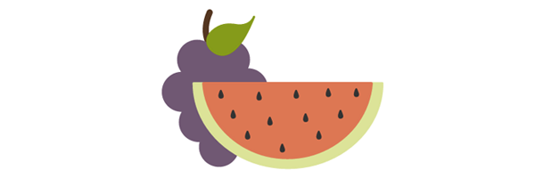

If the group containing the grapes was moved to the end of the document it would then appear in front of the watermelon.

	<svg>
		<g class="watermelon">
			<!--<path <outside path> />-->
			<!--<path <inside path> />-->
			<!--<path <seeds path> />-->
		</g>
		<g class="grapes">
			<!--<path <stem path> />-->
			<!--<path <grapes path> />-->
			<!--<path <leaf path> />-->
		</g>
	</svg>

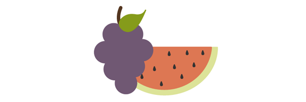

This method of determining stacking order also applies to the individual elements within the group. For example, moving the path of the stem in the grapes image to the end of the group will result in the stem being on top.

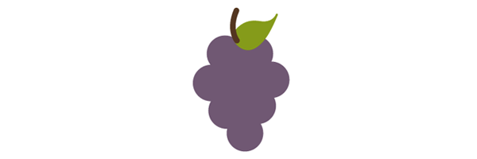

## Section 2. Basic Shapes and Paths

Basic SVG shapes can be written by hand in HTML but you may eventually experience the need to use a much more complex graphic inline. These more complex graphics can be created with vector software, but for now let’s look at the basics that can easily be hand coded.

### Basic Shapes

SVG contains the following set of basic shape elements: rectangles, circles, ellipses, straight lines, polylines, and polygons. Each element requires a set of attributes before it renders, like coordinates and size details.

#### Rectangle

The `<rect>` element defines a rectangle.

		<svg>
  			<rect width="200" height="100" fill="#BBC42A" />
		</svg>

The `width` and `height` attributes establish the size of the rectangle, while `fill` sets the interior color for the shape. The numerical values default to pixels and `fill` would default to black when left unspecified.

Other attributes that can be included are `x` and `y` coordinates. These values will move the shape along the appropriate axis according to the dimensions set by the `<svg>` element.

It is also possible to create rounded corners by specifying values within `rx` and `ry` attributes. For example, `rx="5" ry="10"` will produce horizontal sides of corners that have a 5px radius, and vertical sides of corners that have a 10px radius.

#### Circle

The `<circle>` element is mapped based on a center point and an outer radius.

		<svg>
  			<circle cx="75" cy="75" r="75" fill="#ED6E46" />
		</svg>

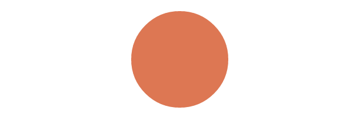

The `cx` and `cy` coordinates establish the location of the center of the circle in relation to the workplace dimensions set by the `<svg>`.

The `r` attribute sets the size of the outer radius.

#### Ellipse

An `<ellipse>` element defines an ellipse that is mapped based on a center point and two radii.

		<svg>
  			<ellipse cx="100" cy="100" rx="100" ry="50" fill="#7AA20D" />
		</svg>

While the `cx` and `cy` values are establishing the center point based on pixel distance into the SVG coordinate space, the `rx` and `ry` values are defining the radius of the sides of the shape.

#### Line

The `<line>` element defines a straight line with a start and end point.

		<svg>
  			<line x1="5" y1="5" x2="100" y2="100" stroke="#765373" stroke-width="8"/>
		</svg>

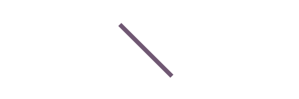

Together the `x1` and `y1` values establish the coordinates for the start of the line, while the `x2` and `y2` values establish the end of the line.

#### Polyline

The `<polyline>` element defines a set of connected straight line segments, generally resulting in an open shape (start and end points that do not connect).

		<svg>
  			<polyline points="0,40 40,40 40,80 80,80 80,120 120,120 120,160" fill="white" 			stroke="#BBC42A" stroke-width="6" />
		</svg>

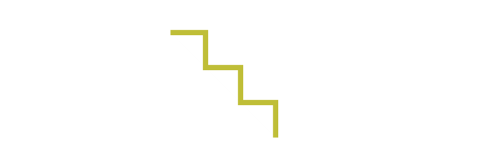

The values within `points` establish the shape's location on the `x` and `y` axis throughout the shape and are grouped as `x,y` throughout the list of values.

An odd number of points here is an error.

#### Polygon

A `<polygon>` element defines a closed shape consisting of connected lines.

		<svg>
  			<polygon points="50,5 100,5 125,30 125,80 100,105 50,105 25,80 25,30" 					fill="#ED6E46" />
		</svg>

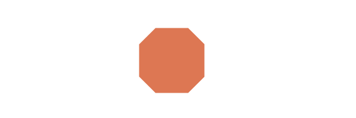

The points of the polygon shape are defined through a series of eight grouped `x,y` values.

This element can also produce other closed shapes depending on the number of defined points.

### The path Element

SVG paths represent the outline of a shape. This shape can be filled, stroked, used to navigate text, and/or used as a clipping path.

Depending on the shape this path can get very complex, especially when there are many [curves](http://www.w3.org/TR/SVG/paths.html#PathDataCurveCommands) involved. Gaining a basic understanding of how they work and the syntax involved, however, will help make these particular paths much more manageable.

#### path data

The path data is contained in a `d` attribute within a `<path>` element, defining the outline for a shape: `<path d="<path data specifics>" />`.

This data included within the `d` attribute spell out the *moveto*, *line*, *curve*, *arc* and *closepath* instructions for the path.

The `<path>` details below define the path specifics for a graphic of a lime:

	<svg width="258px" height="184px">
  		<path fill="#7AA20D" stroke="#7AA20D" stroke-width="9" stroke-linejoin="round" d="M248.761,92c0,9.801-7.93,17.731-17.71,17.731c-0.319,0-0.617,0-0.935-0.021c-10.035,37.291-51.174,65.206-100.414,65.206 c-49.261,0-90.443-27.979-100.435-65.334c-0.765,0.106-1.531,0.149-2.317,0.149c-9.78,0-17.71-7.93-17.71-17.731 c0-9.78,7.93-17.71,17.71-17.71c0.787,0,1.552,0.042,2.317,0.149C39.238,37.084,80.419,9.083,129.702,9.083	c49.24,0,90.379,27.937,100.414,65.228h0.021c0.298-0.021,0.617-0.021,0.914-0.021C240.831,74.29,248.761,82.22,248.761,92z" />
	</svg>

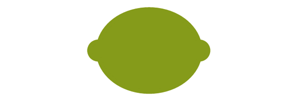

##### moveto

The moveto commands (M or m) establish a new point, as lifting a pen and starting to draw in a new location on paper would. The line of code comprising the path data must begin with a moveto command, as shown in the above example of the lime.

moveto commands that follow the initial one represent the start of a new subpath, creating a compound path. An uppercase M here indicates absolute coordinates will follow, while a lowercase m indicates relative coordinates.

##### closepath

The closepath (Z or z) ends the current subpath and results in a straight line being drawn from that point to the initial point of the path.

If the closepath is followed immediately by a moveto, these moveto coordinates represent the start of the next subpath. If this same closepath is followed by anything other than moveto, the next subpath begins at the same point as the current subpath.

Both an uppercase or lowercase z here have identical outcomes.

##### lineto

The lineto commands draw straight lines from the current point to a new point.

###### L, l

The L and l commands draw a line from the current point to the next provided point coordinates. This new point then becomes the current point, and so on.

An uppercase L signals that absolute positioning will follow, while a lowercase l is relative.

###### H, h

The H and h commands draw a horizontal line from the current point.

An uppercase H signals that absolute positioning will follow, while a lowercase h is relative.

###### V, v

The V and v commands draw a vertical line from the current point.

An uppercase V signals that absolute positioning will follow, while a lowercase v is relative.

##### Curve Commands

There are three groups of commands that draw curved paths: Cubic Bézier (C, c, S, s), Quadratic Bézier (Q, q, T, t), and Elliptical arc (A, a).

The following curve sections will introduce the basic concept behind each curve command, review the mapping details, and then provide a diagram for further understanding.

###### Cubic Bézier

The C and c Cubic Bézier commands draw a curve from the current point using (x1,y1) parameters as a control point at the beginning of the curve and (x2,y2) as the control point at the end, defining the shape details of the curve.

The S and s commands also draw a Cubic Bézier curve, but in this instance there is an assumption that the first control point is a *reflection* of the second control point.

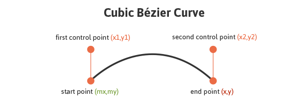

The following code draws a basic Cubic Bézier curve:

	<svg>
  		<path fill="none" stroke="#333333" stroke-width="3" d="M10,55 C15,5 100,5 100,55" />
	</svg>

Manipulating the first and last sets of values for this curve will impact its start and end location, while manipulating the two center values will impact the shape and positioning of the curve itself at the beginning and end.

The S and s commands also draw a Cubic Bézier curve, but in this instance there is an assumption that the first control point is a *reflection* of the last control point for the previous C command. This reflection is relative to the start point of the S command.

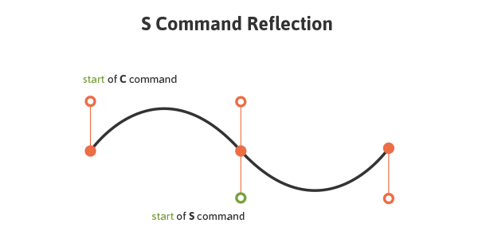

An uppercase C signals that absolute positioning will follow, while a lowercase c is relative. This same logic applies to S and s.

###### Quadratic Bézier

Quadratic Bézier curves (Q, q, T, t) are similar to Cubic Bézier curves except that they only have one control point.

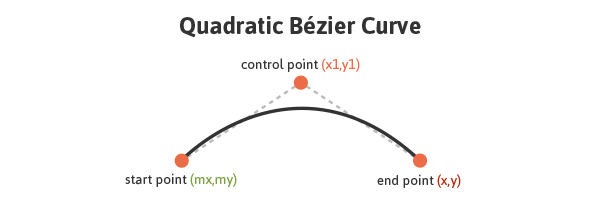

The following code draws a basic Quadratic Bézier curve:

	<svg>
  		<path fill="none" stroke="#333333" stroke-width="3" d="M20,50 Q40,5 100,50" />
	</svg>

Manipulating the first and last sets of values, `M20,50` and `100,50`, impacts the positioning of the beginning and end points of the curve. The center set of values, `Q40,5`, define the control point for the curve, establishing its shape.

Q and q draw the curve from the initial point to the end point using (x1,y1) as the control. T and t draw the curve from the initial point to the end point by assuming that the control point is a reflection of the control on the *previously* listed command relative to the start point of the new T or t command.

An uppercase Q signals that absolute positioning will follow, while a lowercase q is relative. This same logic applies to T and t.

###### Elliptical Arc

An Elliptical Arc (A, a) defines a segment of an ellipse. These segments are created through the A or a commands which create the arc by specifying the start point, end point, x and y radii, rotation, and direction.

Here is a look at the code for a basic Elliptical Arc:

	<svg>
  		<path fill="none" stroke="#333333" stroke-width="3" d="M65,10 a50,25 0 1,0 50,25" />
	</svg>

The first and last sets of values within this path, `M65,10` and `50,25` represent initial and final coordinates, while the second set of values define the two radii. The values of `1,0` (large-arc-flag and sweep-flag) determine how the arc is drawn, as there are four different options here.

The following diagram shows the four arc options and the impact that large-arc-flag and sweep-flag values have on the final rendering of the arc segment.

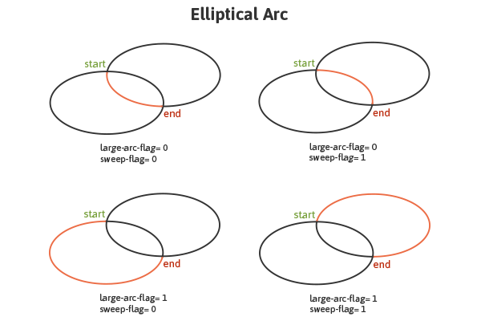

### Embeds From Vector Software

Vector graphics software allows for the generation of more complex shapes and paths while producing SVG code that can be taken, used, and manipulated elsewhere.

Once the graphic is complete, the generated XML code, which can be quite lengthy depending on the complexity, can be copied and embedded into HTML. Breaking down each section of the SVG and having the right organizational elements in place can greatly help in navigating and understanding these seemingly complex and wordy documents.

Here is the SVG code for an image of some cherries with added classes for enhanced navigation:

		<svg width="215px" height="274px" viewBox="0 0 215 274">
			<g>
				<path class="stems" fill="none" stroke="#7AA20D" stroke-width="8" stroke-linecap="round" stroke-linejoin="round" d="M54.817,169.848c0,0,77.943-73.477,82.528-104.043c4.585-30.566,46.364,91.186,27.512,121.498" />
				<path class="leaf" fill="#7AA20D" stroke="#7AA20D" stroke-width="4" stroke-linecap="round" stroke-linejoin="round" d="M134.747,62.926c-1.342-6.078,0.404-12.924,5.762-19.681c11.179-14.098,23.582-17.539,40.795-17.846 c0.007,0,22.115-0.396,26.714-20.031c-2.859,12.205-5.58,24.168-9.774,36.045c-6.817,19.301-22.399,48.527-47.631,38.028 C141.823,75.784,136.277,69.855,134.747,62.926z" />
			</g>
			<g>
				<path class="r-cherry" fill="#ED6E46" stroke="#ED6E46" stroke-width="12" d="M164.836,193.136 c1.754-0.12,3.609-0.485,5.649-1.148c8.512-2.768,21.185-6.985,28.181,3.152c15.076,21.845,5.764,55.876-18.387,66.523 c-27.61,12.172-58.962-16.947-56.383-45.005c1.266-13.779,8.163-35.95,26.136-27.478	C155.46,191.738,159.715,193.485,164.836,193.136z" />
				<path class="l-cherry" fill="#ED6E46" stroke="#ED6E46" stroke-width="12" d="M55.99,176.859 c1.736,0.273,3.626,0.328,5.763,0.135c8.914-0.809,22.207-2.108,26.778,9.329c9.851,24.647-6.784,55.761-32.696,60.78 c-29.623,5.739-53.728-29.614-44.985-56.399c4.294-13.154,15.94-33.241,31.584-20.99C47.158,173.415,50.919,176.062,55.99,176.859z" />
			</g>
		</svg>

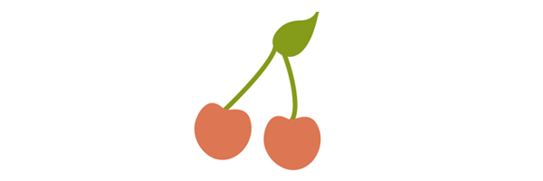

The attributes within the `svg` element define the workspace, or “canvas” for the graphic. The leaf and the stems are within one `<g>` (group), while the cherries are in another. The string of numerical values define the path the graphic will take and the `fill` and `stroke` attributes set the color for the backgrounds and borders.

Once this code is copied it can be run through an SVG optimizer before being placed in HTML, which will help eliminate unnecessary code and spacing and in turn greatly reduce the file size. [Peter Collingridge's SVG Optimiser](http://petercollingridge.appspot.com/svg-optimiser) or [SVGO](https://github.com/svg/svgo) are tools that are very helpful in this regard.

## Section 3. The Workspace

Perhaps the most important aspect of SVG, after understanding its general structure and how to create basic shapes, is getting a grasp of the workspace in use, or in other words, the coordinate system to which the graphics will be mapped.

Understanding the workspace of SVG is helpful in properly rendering your artwork, but becomes crucial once you get into more advanced SVG features. For example, the mapping of gradients and patterns relies heavily on the established coordinate system. This workspace is defined by the dimensions of the viewport and `viewBox` attributes.

This pear, happily, has a matching viewport and `viewBox`:

		<svg width="115" height="190" viewBox="0 0 115 190">
    		<!--<path <pear's drawing path> />-->
  		</svg>

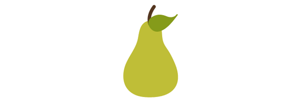

The entire pear is visible in the browser and will scale accordingly when the viewport dimensions are changed.

### viewport

The viewport is the visible section of an SVG. While SVG can be as wide or as high as you wish, limiting the viewport will mean that only a certain section of the image can be visible at a time.

The viewport is set through `height` and `width` attributes within the `<svg>`.

If these values are not defined, the dimensions of the viewport will generally be determined by other indicators within the SVG, like the width of the outermost SVG element. However, leaving this undefined leaves our artwork susceptible to being cut off.

### viewBox

The `viewBox` allows for the specification that a given set of graphics stretch to fit a particular container element. These values include four numbers separated by commas or spaces: `min-x`, `min-y`, `width`, and `height` that should generally be set to the bounds of the viewport.

The `min` values represent at what point within the image the viewBox should start, while the `width` and `height` establish the size of the box.

If we choose not to define a `viewBox` the image will not scale to match the bounds set by the viewport.

If 50px were taken off the `width` and `height` of the pear image `viewBox`, the portion of the pear that is visible is reduced, but then what is left visible will scale to fit to the bounds of the viewport.

		<svg width="115px" height="190px" viewBox="0 0 65 140">
			<!--<path <pear's drawing path> />-->
		</svg>

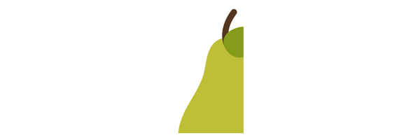

The `min` values within the `viewBox` define the origin of the `viewBox` within the parent element. In other words, the point within the `viewBox` at which you want it to begin matching up the viewport. In the above pear image, the `min` values are set to 0,0 (top left). Let's change these to 50, 30: `viewBox="50 30 115 190"`.

		<svg width="115" height="190" viewBox="50 30 115 190">
			<!--<path <pear's drawing path> />-->
		</svg>

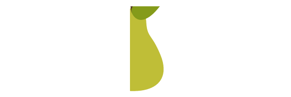

The `viewBox` now starts 50px in from the `x` axis and 30px in from the `y` axis. In altering these values the section of the pear that is focused on has changed.

#### preserveAspectRatio

If the viewport and `viewBox` do not have the same width to height ratio, the `preserveAspectRatio` attribute directs the browser how to display the image.

`preserveAspectRatio` takes two parameters, `<align>` and `<meetOrSlice>`. The first parameter takes two parts and directs the `viewBox`'s alignment within the viewport. The second is optional and indicates how the aspect ratio is to be preserved.

`preserveAspectRatio="xMaxYMax meet"`

These values will align the bottom right corner of the `viewBox` to the bottom right corner of the viewport. `meet` preserves the aspect ratio by scaling the `viewBox` to fit within the viewport as much as possible.

There are three `<meetOrSlice>` options: meet (default), slice, and none. While `meet` ensures complete visibility of the graphic (as much as possible), `slice` attempts to fill the viewport with the `viewBox` and will then slice off any part of the image that does not fit inside the viewport after this scaling. `none` results in no preserved aspect ratio and a potentially distorted image.

Perhaps the most straightforward value here is "none", which establishes that uniform scaling should not be applied. If we then increase the pixel values of the viewport, the below image of cherries will stretch non-uniformly and look distorted.

		<svg width="500" height="400" viewBox="0 0 250 600" preserveAspectRatio="none">
			<!--<path <cherry drawing path> />-->
		</svg>

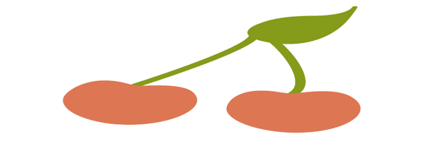

The `preserveAspectRatio` for the image below is set to `xMinYMax meet` which is aligning the bottom left corner of the `viewBox` to the bottom left corner of the viewport (which is now outlined). `meet` is ensuring the image is scaling to fit inside the viewport as much as possible.

		<svg width="350" height="150" viewBox="0 0 300 300" preserveAspectRatio="xMinYMax meet" style="border: 1px solid #333333;">
			<!--<path <cherry drawing path> />-->
		</svg>

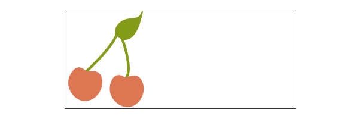

Here are the same cherries when `meet` is changed  to `slice`:

		<svg width="350" height="150" viewBox="0 0 300 300" preserveAspectRatio="xMinYMax slice" style="border: 1px solid #333333;">
			<!--<path <cherry drawing path> />-->
		</svg>

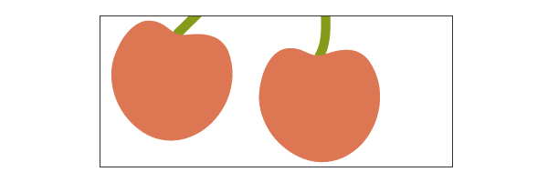

Note that the alignment values do not have to correlate.

		<svg width="350" height="150" viewBox="0 0 300 300" preserveAspectRatio="xMinYMid slice" style="border: 1px solid #333333;">
			<!--<path <cherry drawing path> />-->
		</svg>

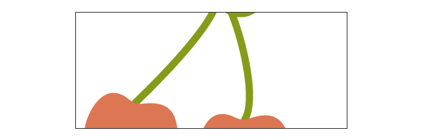

The above example has a `preserveAspectRatio` of `xMinYMid slice`; the cherries are now aligned along the middle of the `y` axis of the viewport.

### Coordinate System Transforms

SVG enables the additional altering of graphics such as rotation, scaling, moving, and skewing through the use of transforms. The SVG author can apply transforms to individual elements or to an entire group of elements.

These functions are included within the element to be manipulated and reside within the `<transform>` attribute. Multiple transforms can be used by including several functions inside this attribute, for example: `transform="translate(<tx>,<ty>) rotate(<rotation angle>)" />`.

Something important to keep in mind when transforming SVG is that it will impact your coordinate system, or workspace. This is because [transforms create a new user space](http://www.w3.org/TR/SVG/coords.html#EstablishingANewUserSpace) by essentially copying the original and then placing the transformation on the new system itself.

The following image demonstrates the coordinate system transform that takes place when placing a translation of (100,100) on the group containing the graphic:

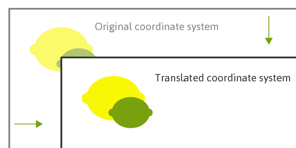

The coordinate system itself has been translated and the image of the lime and lemon has maintained its original positioning within this system. The new user coordinate system has its origin at location (100,100) in the original coordinate system.

Because of this relationship with the coordinate system, many of these functions will move the graphic even if you are not directly setting a translation on it. For example, attempting to triple an image’s size by including a `scale` value of "3" is multiplying the `x` and `y` coordinates by "3" and the image is scaling along with it, moving it across the screen in the process.

In the case of nested transforms the effects are cumulative, so the final transform on a child element will be based on the accumulation of the transforms before it.

#### translate

The `translate` function specifies the details of moving a shape, and the two numerical values included here direct movement along both the `x` and `y` axis: `transform="translate(<tx>,<ty>)"`. These values can be separated by either whitespace or commas.

The `y` value here is optional and if omitted a value of "0" is assumed.

#### rotate

A value within `rotate` will specify the shape's rotation at its point of origin (in degrees), which for SVG is 0,0 (top left): `transform="rotate(<rotation angle>)"`.

There is also an option here to include `x` and `y` values: `transform=rotate(<rotation angle> [<cx>,<cy>])`. If supplied, these values establish a new center of rotation other than what is defaulted to (which is 0,0).

Here is an apple before and after having a 20 degree rotation applied: `transform="rotate(20)"`.
*Note that this image does not reflect the coordinate change this transform makes.*

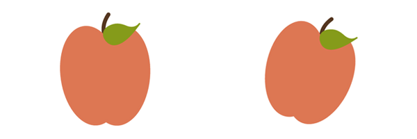

#### scale

Scaling allows the resizing of SVG elements through the use of the `scale` function. This function accepts one or two values which specify horizontal and vertical scaling amounts along the appropriate axis: `transform="scale(<sx> [<sy>])"`.

The `sy` value is optional and if omitted it is assumed to be equal to `sx` to ensure consistent resizing.

A `scale` value of ".5" would render a graphic half the size it was originally, while a value of "3" would triple this initial size. A value of "4,2" would scale a graphic four times its original width, and two times its original height.

#### skew

SVG elements can be skewed, or made crooked, through the use of the `skewX` and `skewY` functions. The value included within these functions represents a skew transformation in degrees along the appropriate axis.

Here is a look at an apple before and after adding a `skewX` value of "20": `transform="skewX(20)"`. *Note that this image does not reflect the coordinate change this transform makes.*

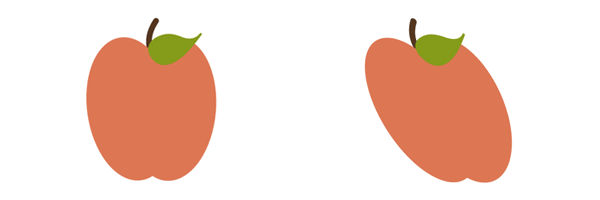

## Section 4. Fills and Strokes

`fill` and `stroke` allow us to paint to the interior and border of SVG.

"[Paint](http://www.w3.org/TR/SVG/painting.html#Introduction)" refers to the action of applying colors, gradients, or patterns to graphics through `fill` and/or `stroke`.

### fill Properties

The `fill` attribute paints the interior of a specific graphical element. This fill can consist of a solid color, gradient, or pattern.

The interior of a shape is determined by examining all subpaths and specifications spelled out within the `fill-rule`.

When filling a shape or path, `fill` will paint open paths as if the last point of the path connected with the first, even though a `stroke` color on this section of the path would not render.

#### fill-rule

The `fill-rule` property indicates the algorithm to be used in determining which parts of the canvas are included inside the shape. This is not always straightforward when working with more complex intersecting or enclosed paths.

The accepted values here are `nonzero`, `evenodd`, `inherit`.

##### nonzero

A value of `nonzero` determines the inside of a point on the canvas by drawing a line from the area in question through the entire shape in any direction and then considering the locations where a segment of the shape crosses this line. This starts with zero and adds one each time a path segment crosses the line from left to right and subtracts one each time a path segment crosses the line from right to left.

If the result is zero after evaluating and counting these intersections then the point is outside the path, otherwise it is inside.

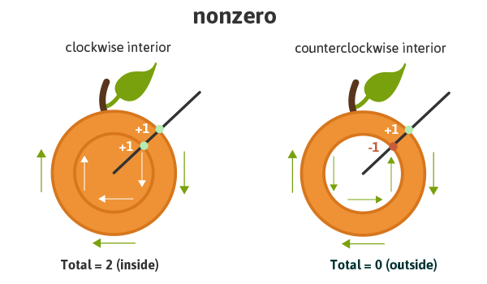

Essentially, if the interior path is drawn clockwise it will be considered as "inside", but if drawn counter-clockwise it will be considered "outside" and therefore be excluded from painting.

##### evenodd

A value of `evenodd` determines the inside of an area on the canvas by drawing a line from that area through the entire shape in any direction and counts the path segments that the line crosses. If this results in an odd number the point is inside, if even the point is outside.

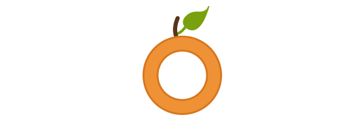

Given the specific algorithm of the `evenodd` rule, the drawing direction of the interior shape in question is irrelevant, unlike with `nonzero`, as we are simply counting the paths as they cross the line.

While this property is not generally necessary, it will allow for greater `fill` control of a complex graphic, as mentioned.

##### inherit

A value of `inherit` will direct the element to take on the `fill-rule` specified by its parent.

#### fill-opacity

The `fill-opacity` value refers to the opacity level of the interior paint fill. A value of "0" results in complete transparency, "1" applies no transparency, and values in between represent a percentage-based level of opacity.

### Stroke Attributes

There are a number of stroke-related attributes within SVG that allow for the control and manipulation of stroke details. The abilities of these attributes provide for greater control of hand-coded SVG, but also prove convenient when needing to make edits to an existing embedded graphic.

The following examples use an inline SVG of grapes. The attributes being used reside directly within the correlating shape’s element.

#### stroke

The `stroke` attribute defines the “border” paint of particular shapes and paths.

The following grapes image has a purple stroke: `stroke="#765373"`.

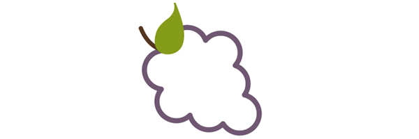

#### stroke-width

The `stroke-width` value establishes the width of the grape’s stroke, which is set to `6px` on the grapes image.

The default value for this attribute is 1. If a percentage value is used, the value is based on the dimensions of the viewport.

#### stroke-linecap

`stroke-linecap` defines which shape the end of an open path will take and there are four acceptable values: `butt`, `round`, `square`, `inherit`.

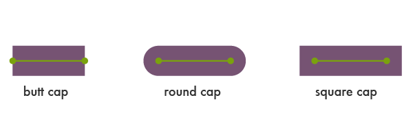

A value of `inherit` will direct the element to take on the `stroke-linecap` specified by its parent.

The stem in the following image has a `stroke-linecap` value of `square`:

	<svg>
    	<!--<path <path for grapes> />-->
    	<!--<path stroke-linecap="square" <path for stem> />-->
    	<!--<path <path for leaf> />-->
  	</svg>

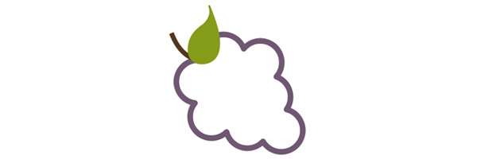

#### stroke-linejoin

`stroke-linejoin` defines how the corners of strokes will look on paths and basic shapes.

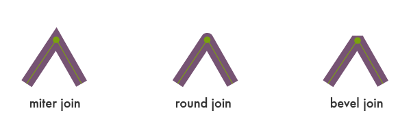

Here is a look at the grapes with a `stroke-linejoin` of `"bevel"`:

	<svg>
    	<!--<path stroke-linejoin="bevel" <path for grapes> />-->
    	<!--<path <path for stem> />-->
    	<!--<path <path for leaf> />-->
  	</svg>

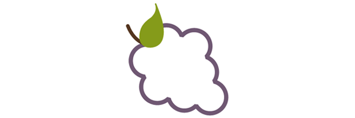

##### stroke-miterlimit

When two lines meet at a sharp angle and are set to a `stroke-linejoin="miter"`, the `stroke-miterlimit` attribute allows for the specification of how far this joint/corner extends.

The length of this joint is called the miter length, and it is measured from the inner corner of the line join to the outer tip of the join.

This value is a limit on the ratio of the miter length to the `stroke-width`.

1.0 is the smallest possible value for this attribute.

The first grape image is set to `stroke-miterlimit="1.0"`, which creates a bevel effect. The `stroke-miterlimit` on the second image is set to `4.0`.

#### stroke-dasharray

The `stroke-dasharray` attribute turns paths into dashes rather than solid lines.

Within this attribute you can specify the length of the dash as well as the distance between the dashes, separated with commas or whitespace.

If an odd number of values are provided, the list is then repeated to produce an even number of values. For example, `8,6,4` becomes `8,6,4,8,6,4` as shown in the second grapes image below.

Placing just one number within this value results in a space between the dashes that is equal to the length of a dash.

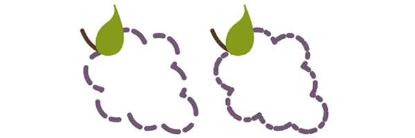

The first grapes image here shows the impact that an even number of listed values has on the grape's path: `stroke-dasharray="20,15,10,8"`.

#### stroke-dashoffset

`stroke-dashoffset` specifies the distance into the dash pattern to start the dash.

	<svg>
    	<!--<path stroke-dasharray="40,10" stroke-dashoffset="35" <path for grapes> />-->
    	<!--<path <path for stem> />-->
    	<!--<path <path for leaf> />-->
  	</svg>

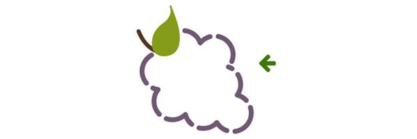

In the example above, there is a dash set to be 40px long, and a `dashoffset` of 35px. At the starting point of the path the dash will not become visible until 35px in to the first 40px dash, which is why the first dash appears significantly shorter.

#### stroke-opacity

The `stroke-opacity` attribute allows for a transparency level to be set on strokes.

The value here is a decimal number between 0 and 1, with 0 being completely transparent.

## Section 5. The text Element

The `<text>` element defines a graphic consisting of text. There are a number of attribute options for customization of this text, and gradients, patterns, clipping paths, masks, or filters can also be applied.

Writing and editing `<text>` in SVG provides a very powerful ability to create scalable text as graphics that can be easily changed and edited within the SVG code.

Remember to be mindful of viewport dimensions when working through the examples in this section. The viewport, as mentioned, will determine the visible portion of the SVG and it may be necessary to change the viewport depending on the alteration specifics.

### Basic Attributes

SVG text attributes reside within the `<text>` element, which resides inside the `<svg>` element. Through these attributes we can control some basic styling for our text as well as completely spell out its mapping details on the canvas, enabling full control of its placement on the screen.

#### x, y, dx, dy

The first letter within a `<text>` element is rendered according to the established `x` and `y` values. While the `x` value determines where to start the text along the x axis, the `y` value determines the horizontal location of the *bottom* of the text.

While `x` and `y` establish coordinates in an absolute space, `dx` and `dy` establish relative coordinates. This is especially handy when used in conjunction with the `<tspan>` element, which will be discussed further in an upcoming section.

		<svg width="620" height="100">
    		<text x="30" y="90" fill="#ED6E46" font-size="100" font-family="'Leckerli One', cursive">Watermelon</text>
  		</svg>

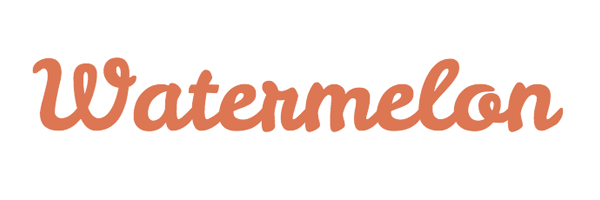

The above text starts 30px into the viewport of the SVG, and the bottom of the text is set 90px in from the top of this viewport: `x="30" y="90"`.

#### rotate

A rotation can be placed on the individual letters/symbols, and/or on the element as a whole.

A single value within the `rotate` attribute results in each glyph rotating at that value. A string of values can also be used to target and assign a different rotation value to each letter. If there are not enough values to match the number of letters, the last value sets the rotation for the remaining characters.

The text below has a rotation set on the entire graphic through the `transform` element, but also a value for each glyph: `rotate="20,0,5,30,10,50,5,10,65,5"`.

		<svg width="600" height="250">
    		<text x="30" y="80" fill="#ED6E46" font-size="100" rotate="20,0,5,30,10,50,5,10,65,5" transform="rotate(8)" font-family="'Leckerli One', cursive">Watermelon</text>
  		</svg>

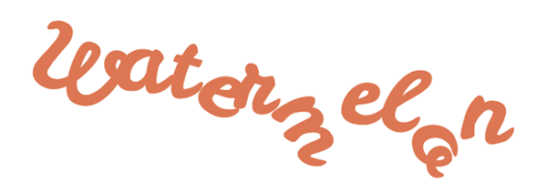

#### textLength & lengthAdjust

The `textLength` attribute specifies the length of the text. The length of the text will adjust to fit the length specified within this attribute by altering the space between the provided characters.

The following example has a `textLength` value of 900px. Notice that the spacing between the characters has increased to fill this space.

		<svg width="950" height="100">
    		<text x="30" y="90" fill="#ED6E46" font-size="100" textLength="900" font-family="'Leckerli One', cursive">Watermelon</text>
  		</svg>

When used in conjunction with the `lengthAdjust` attribute, it can be specified that both the letter spacing and glyph size should adjust to fit to these new length values.

A value of `"spacing"` results in an image that resembles the example above where the spacing between the characters has expanded to fill the space: ‘lengthAdjust=”spacing”’.

A value of `"spacingAndGlyphs"` directs both the spacing and the glyph size to adjust accordingly: `lengthAdjust="spacingAndGlyphs"`.

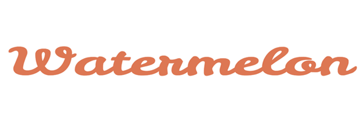

### The tspan Element

The `<tspan>` element is significant because SVG does not currently support automatic line breaks or word wrapping. `<tspan>` allows us to draw multiple lines of text by singling out certain words or characters to then be manipulated independently.

Instead of defining a new coordinate system for these additional lines, the `<tspan>` element positions these new lines of text in relation to the previous line of text.

The `<tspan>` element has no visual output on its own, but by specifying more details within the elements we can single out this particular text and have more control over its design and positioning.

In the example below "are" and "delicious" are located within separate `<tspan>` elements within the `<text>` element. By using `dy` within each of these spans, we are positioning the word along the y axis in relation to the word before it.

While "are" is positioned -30px from "Watermelons", "delicious" is positioned 50px from "are".

 		<svg width="775" height="500">
    		<text x="15" y="90" fill="#ED6E46" font-size="60" font-family="'Leckerli One', cursive"> Watermelons
      			<tspan dy="-30" fill="#bbc42a" font-size="80">are</tspan>
      			<tspan dy="50">delicious</tspan>
    		</text>
  		</svg>

You can also move each glyph individually through a list of values, as shown in the example below. The letter/symbol is then moved according to the position of the letter/symbol before it, and "delicious" is now positioned according to the "e" in "are".

The `tspan` containing “are” has the following list of `dy` values: `dy="-30 30 30"`.

### Spacing Properties

There are a number of properties available when using the `<text>` element within inline SVG that control the spacing of words and letters, similar to the capabilities of vector graphic software.

Understanding how to use these properties helps ensure graphics are displayed exactly as intended.

#### kerning & letter-spacing

Kerning refers to the process of adjusting the spacing between characters. The `kerning` property allows us to adjust this space based on the kerning tables that are included in the font being used, or set a unique length.

A value of `auto` indicates that the inter-glyph spacing should be based on the kerning tables that are included in the font being used.

The example below has a `kerning` value of `auto`, which in this instance has no visual impact since it is the default value.

		<svg width="420" height="200">
    		<text x="2" y="50%" fill="#ef9235" font-size="100" font-family="'Raleway', sans-serif" font-weight="bold" kerning="auto">Oranges</text>
  		</svg>

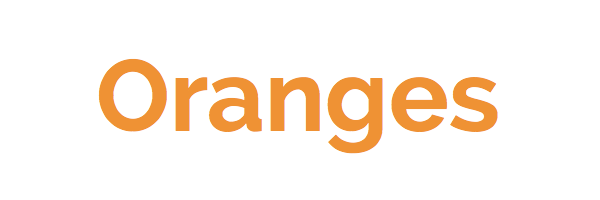

Adjusting the length between these characters can be done by simply including a numerical value: `kerning="30"`.

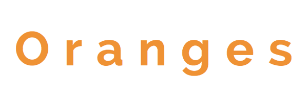

A value of `inherit` is also valid.

`letter-spacing` has value options of `normal`, `<length>`, or `inherit`. A numerical value here will have the same impact on the spacing as `kerning`. The `letter-spacing` property is intended to be used as supplemental spacing to any spacing already in effect from `kerning`.

#### word-spacing

Th `word-spacing` property specifies the spacing between words.

	<svg width="750" height="200">
    	<text x="2" y="50%" fill="#ef9235" font-size="70" font-family="'Raleway', sans-serif" word-spacing="30">Oranges are Orange</text>
  	</svg>

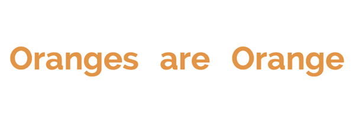

Other valid values here are `normal` (default), and `inherit`.

### text-decoration

The `text-decoration` property permits the use of `underline`, `overline`, and `line-through` in SVG text.

While drawing order does not always have an impact on visual output in SVG, the order does matter in regards to `text-decoration`.  All text decoration values, except `line-through`, should be drawn *before* the text is filled and/or stroked; this renders the text on top of the decorations.

`line-through` should be drawn after the text is filled and/or stroked, rendering the decoration on top of the text.

Here is a look at `text-decoration="underline"` and `text-decoration="line-through"`.

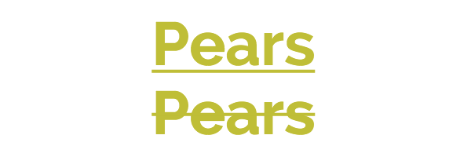

### text Along a Path

As mentioned, inline SVG provides us with advanced customization options that are similar to the capabilities of vector graphic software. Within the SVG code itself we can position text exactly as we want it to render on the screen.

In taking this manipulation even further, SVG `<text>` can be set to follow a given `<path>` element.

#### The textPath Element

The `textPath` element is where all the magic of this feature resides. While SVG text would generally reside within a `<text>` element, it will now reside within a `<textPath>` element within the `<text>` element.

This `<textPath>` will then call on the chosen path's `id` which is hanging out in a `<defs>` element waiting to be used.

The basic syntax:

	<svg>
    	<defs>
  			<path id="testPath" d="<....>"/>
  	    </defs>
       <text>
      		<textPath xlink:href="#testPath">Place text here</textPath>
       </text>
    </svg>

Here is a look at the vector path to be used in the code below:

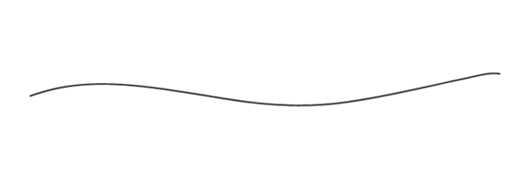

After generating this path in vector graphic software the SVG *`<path>` element* code itself (which will not include color like shown above) can be copied and placed within the `<defs>` element in the `<svg>`, which is also shown in the code above.

	<svg width="620" height="200">
    	 <defs>
  			<path id="testPath" d="M3.858,58.607 c16.784-5.985,33.921-10.518,51.695-12.99c50.522-7.028,101.982,0.51,151.892,8.283c17.83,2.777,35.632,5.711,53.437,8.628 c51.69,8.469,103.241,11.438,155.3,3.794c53.714-7.887,106.383-20.968,159.374-32.228c11.166-2.373,27.644-7.155,39.231-4.449" />
  	     </defs>
     	 <text x="2" y="40%" fill="#765373" font-size="30" font-family="'Lato', sans-serif">
     		<textPath xlink:href="#testPath">There are over 8,000 grape varieties worldwide.</textPath>
     	 </text>
   	</svg>

##### xlink:href

The `xlink:href` attribute in a `<textPath>` allows us to reference the path to which the text will be rendered on.

##### startOffset

The `startOffset` attribute represents a text offset length from the start of the `path`. A value of "0%" indicates the start point of the `path`, while "100%" indicates the end point.

The example below has a `startOffset` of "20%" which pushes the text to begin 20% in along the path. The font size has been decreased to prevent it from rendering out of the viewport when moved.

Adding color to the path's stroke via the `<use>` element can aid in understanding what exactly is happening here.

		<svg width="620" height="200">
     		<defs>
  				<path id="testPath" d="M3.858,58.607 c16.784-5.985,33.921-10.518,51.695-12.99c50.522-7.028,101.982,0.51,151.892,8.283c17.83,2.777,35.632,5.711,53.437,8.628 c51.69,8.469,103.241,11.438,155.3,3.794c53.714-7.887,106.383-20.968,159.374-32.228c11.166-2.373,27.644-7.155,39.231-4.449" />
  			</defs>
    		<use xlink:href="#testPath" fill="none" stroke="#7aa20d" stroke-width="2"/>
    		<text x="2" y="40%" fill="#765373" font-size="20" font-family="'Lato', sans-serif">
      			<textPath xlink:href="#testPath" startOffset="20%">There are over 8,000 grape varieties worldwide.
      			</textPath>
    		</text>
  		</svg>

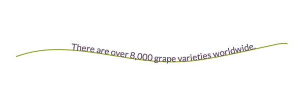

## Section 6. Advanced Features: Gradients, Patterns, Clipping Paths

### Gradients

There are two types of SVG gradients: linear and radial. Linear gradients are generated in a straight line, while radial gradients are circular.

A very simple linear gradient is structured like this:

	<svg>
    	<defs>
        	<linearGradient id="gradientName">
            	<stop offset="<%>" stop-color="<color>" />
            	<stop offset="<%>" stop-color="<color>" />
        	</linearGradient>
    	</defs>
	</svg>

The `<svg>` contains a `<defs>` element which allows us to create reusable definitions to be called on later. These definitions have no visual output until they are referenced using their unique ID within the stroke and/or fill attributes for SVG shapes or `<text>`. These shapes and/or text will also reside within the `<svg>` element, but outside of the `<defs>` element.

Once a gradient is built and assigned an ID, it can be called through the `fill` and/or `stroke` attributes within the SVG. For example, `fill= "url(#gradientName)"`.

#### Linear Gradients

Linear  gradients change color evenly along a straight line and each point (stop) defined on this line will represent the correlating color within the `<linearGradient>` element. At each point the color is at 100% saturation, and the space in between expresses a transition from one color to the next.

##### stop Nodes

`<stop>` nodes can also accept an opacity with `stop-opacity="<value>"`

Below is the code for a simple linear gradient with two color stops applied to a rectangle:

		<svg width="405" height="105">
    		<defs>
      			<linearGradient id="Gradient1" x1="0" y1="0" x2="100%" y2="0">
        			<stop offset="0%" stop-color="#BBC42A" />
        			<stop offset="100%" stop-color="#ED6E46" />
      			</linearGradient>
    		</defs>
    		<rect x="2" y="2" width="400" height="100" fill= "url(#Gradient1)" stroke="#333333" stroke-width="4px" />
  		</svg>

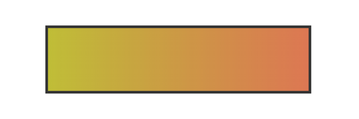

`offset` informs the gradient at what point to assign the correlating `stop-color`.

##### x1, y1, x2, y2

The x1, y1, x2, and y2 attribute values represent the start and end points onto which the gradient stops (color changes) are mapped. These percentages will map the gradients respectively along the appropriate axis.

A `y` value of “100%” and an `x` value of “0” will produce a horizontal gradient, while the reverse will produce a vertical one. Having both values set at “100%” (or any value outside of 0) will render an angled gradient.

##### gradientUnits

The `gradientUnits` attribute defines the coordinate system for the x1, x2, y1, y2 values. The two value options here are ‘userSpaceOnUse’ or ‘objectBoundingBox’. `userSpaceOnUse` sets the gradient coordinating system in absolute units, while `objectBoundingBox` (default) establishes this system within the bounds of the SVG shape itself, the target.

##### spreadMethod

The `spreadMethod` attribute’s value specifies how the gradient will spread out through the shape if it starts or ends inside the bounds of the target. If the gradient is set to not fill the shape, `spreadMethod` determines how the gradient should go about covering that empty space. There are three options here: ‘pad’, ‘repeat’, or ‘reflect’.

A value of `pad` (default) directs the first and last colors of the gradient to spread out over the remainder of the uncovered target region. A value of `repeat` directs the gradient to repeat the pattern from the beginning continuously. A value of `reflect` will reflect the gradient pattern alternating from start-to-end, end-to-start continuously.

The start and end point for the gradient below is: x1="20%" y1="30%" x2="40%" y2="80%".

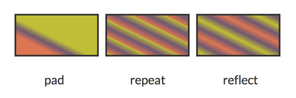

##### gradientTransform

The `gradientTransform` attribute is optional and allows for further transformation of the gradient before it is mapped, like adding a rotation.

##### xlink:href

The `xlink:href` attribute allows you to call on the ID of another gradient to inherit its details, but you can also include different values.

		<linearGradient id="repeat" xlink:href="#Gradient-1” spreadMethod="repeat" />

This gradient inherits the details of the first gradient from the beginning of this section, but has an alternate spreadMethod value.

#### Radial Gradients

Most of the attributes for a `<radialGradient>` are the same as those of `<linearGradient>` except there is a different set of coordinates to work with.

##### cx, cy, r

The `cx`, `cy`, and `r` attributes define the outermost section of the circle and the 100% `stop-color` of the gradient will be mapped to the perimeter of this value. `cx` and `cy` define the center coordinate, while `r` sets the radius of the gradient.

##### fx, fy

The `fx`, `fy` attributes represent the coordinates for the gradient’s focal point, or innermost circle. Essentially, the center of the gradient does not have to also be its focal point, which can be altered with these values.

While by default the focal point of the radial gradient would be centered, the focal point attributes can change this. The focal point values for the image below are `fx="95%" fy="70%"`.

		<svg width="850px" height="300px">
    		<defs>
      			<radialGradient id="Gradient2" cy="60%" fx="95%" fy="70%" r="2">
        			<stop offset="0%" stop-color="#ED6E46" />
        			<stop offset="10%" stop-color="#b4c63b" />
        			<stop offset="20%" stop-color="#ef5b2b" />
        			<stop offset="30%" stop-color="#503969" />
        			<stop offset="40%" stop-color="#ab6294" />
        			<stop offset="50%" stop-color="#1cb98f" />
        			<stop offset="60%" stop-color="#48afc1" />
        			<stop offset="70%" stop-color="#b4c63b" />
        			<stop offset="80%" stop-color="#ef5b2b" />
        			<stop offset="90%" stop-color="#503969" />
        			<stop offset="100%" stop-color="#ab6294" />
      			</radialGradient>
    		</defs>
    		<text x="20%" y="75%" fill= "url(#Gradient2)" font-family= "'Signika', sans-serif" font-size="200">Cherry</text>
  		</svg>

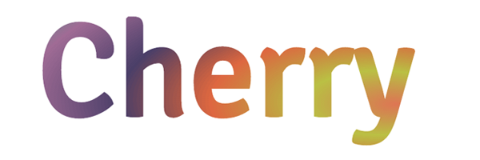

In this example, the focal point shifts to the bottom right of the image.

### Patterns

Patterns are generally considered one of the more complex paint options available to color the fills and strokes of SVG. Establishing a foundation and understanding the basic syntax can make these seemingly more complex patterns much more obtainable.

Here is a look at the syntax for a basic pattern applied to a rectangle:

		<svg width="220" height="220">
    		<defs>
      			<pattern id="basicPattern" x="10" y="10" width="40" height="40" 								patternUnits="userSpaceOnUse">
       				<circle cx="20" cy="20" r="20" fill= "#BBC42A" />
    			</pattern>
  			</defs>
  			<rect x="10" y="10" width="200" height="200"
      		stroke="#333333" stroke-width="2px" fill="url(#basicPattern)" />
  		</svg>

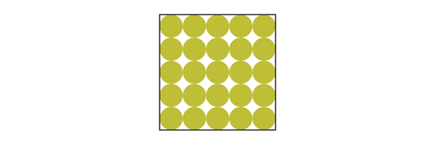

#### Basic Attributes

The attributes and values for patterns define the "canvas", the design, and overall positioning. Patterns can consist of paths and/or shapes, can paint text, and can even be nested within another pattern.

##### x, y, width, height

The x and y attributes within the `<pattern>` element define how far into the shape the pattern will start. Width and height used within the `<pattern>` element define the actual width and height of the allotted pattern space.

The “basicPattern” referenced above contains the following values: `x="10" y="10" width="40" height="40"`. The pattern will start 10px in from the start of the x axis, 10px in from the start of the y axis, and essentially create a “canvas” that is 40px wide, and 40px high.

##### patternUnits

The `patternUnits` attribute defines the coordinates for which x, y, width, and height are referenced. The two options here are `userSpaceOnUse` and `objectBoundingBox` (default).

`userSpaceOnUse` results in a pattern coordinate system that is determined by the coordinate system for the element referencing the `<pattern>`, while `objectBoundingBox` establishes the mapping coordinate system as the bounding box of the element to which the pattern is applied.

##### patternContentUnits

The `patternContentUnits` attribute values are the same as the values for `patternUnits`, except the coordinate system is now being defined for the contents of the pattern itself.

This value, unlike `patternUnits`, defaults to `userSpaceOnUse`, which means that unless one or both of these attributes are specified the shapes drawn within the `<pattern>` are being drawn in  a different coordinate system than the `<pattern>` element is using.

Defining `patternUnits="userSpaceOnUse"` within the `<pattern>` element simplifies this process and ensures a consistent workspace.

#### Nested Patterns

Patterns can also be nested to create a much more unique and detailed design.

Here is a look at the structure of a basic nested pattern:

	<svg width="204" height="204">
  		<defs>
    		<pattern id="circlePattern"
             x="4" y="4" width="75" height="75"
             patternUnits="userSpaceOnUse">
      			<circle cx="12" cy="12" r="8"
            stroke="#ed6e46" stroke-width="3" fill="#765373" />
    		</pattern>
			<pattern id="rectPattern"
             x="10" y="10" width="50" height="50"
             patternUnits="userSpaceOnUse">
      			<rect x="2" y="2" width="30" height="30"
              stroke="#bbc42a" stroke-width="3" fill="url(#circlePattern)" />
    		</pattern>
  		</defs>
  		<rect x="2" y="2" width="200" height="200"
      stroke="#333333" stroke-width="3" fill="url(#rectPattern)" />
	</svg>

The `<defs>` element contains both patterns. Within `<defs>`, the pattern for the rectangle is calling on the circle pattern via `fill` and the main rectangle is then calling on the rectangle pattern also via `fill`, painting the interior of the main shape with a nested pattern.

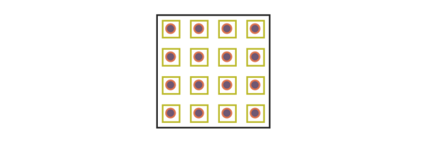

### Clipping Path

The clipping path restricts the region to which paint will be applied to the SVG. Any region drawn outside of the bounds set by the clipping path will not be rendered.

To demonstrate the abilities of this feature, let's use a clipping path consisting of "Apples" text being applied over a tomato colored rectangle and a green circle.

Below are the shapes without the clipping path applied, set to stretch beyond the viewport.

Now, here's a look at the code to apply the "Apples" text to this "canvas".

 	<svg width="400px" height="200px">
    	<clipPath id="clip-text">
      		<text x="0" y="50%" fill="#f27678" font-size="120px" font-family=" 'Signika', sans-serif">Apples</text>
    	</clipPath>
    	<rect x="0" y="0" width="200" height="200" fill="#ed6e46" clip-path="url(#clip-text)" />
    	<circle cx="310" cy="100" r="135" fill="#bbc42a" clip-path="url(#clip-text)" />
  	</svg>

The clipping path is defined within the `<clipPath>` element and then called on by both shapes by referencing its unique `id`.

## Conclusion

Writing inline SVG enables very useful editing powers and lets us as the author have complete access to all the graphical elements individually. Within this code we are generating graphics that scale without losing image quality, are searchable, and enhance accessibility.

It will most likely take some time tinkering to get comfortable with your SVG writing abilities, but once you do I would recommend working on making your code as short and efficient as possible, exploring [SMIL animations](http://www.w3.org/TR/smil-animation/), and experimenting with [styling SVG elements with CSS](https://developer.mozilla.org/en-US/docs/Web/Guide/CSS/Getting_started/SVG_and_CSS).

Hopefully this guide acts as both a valuable reference, and an inspiration in terms of understanding the powerful potential of building and manipulating inline SVG.

For news and updates, please visit [the book's site](http://svgpocketguide.com/), and if you have any questions or comments in regards to the book I can be reached [on Twitter](https://twitter.com/JoniTrythall) or by email at [info@jonibologna.com](mailto:info@jonibologna.com).

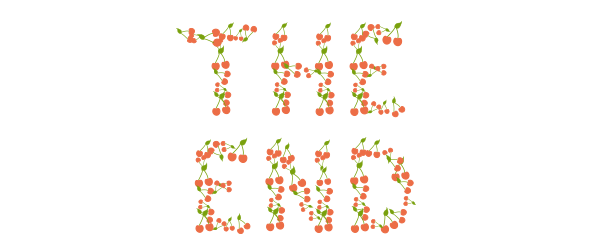
